# Morphe 生态架构分析报告

## 1. 范围、采集方法与证据规则

本报告是 CometDash Patches 培养路线的 Phase 1 产物。研究范围仅限 MorpheApp 组织内全部未归档公开仓库，以及由固定依赖或调用边证明进入 Patch 发现、构建、发布、加载、选择、APK 变换、签名、输出或安装路径的组件。本报告没有编写 Patch、没有检查或反编译 APK、没有复制或 vendor 上游源码，也没有进入 Phase 2 的 official Voice over translation 研究。

- 执行基线：`dev@0e2dd4394ec853278a74f7456f761bb8cad16ea1`。
- 清单采集：`2026-07-19T10:02:25+08:00`（`Asia/Hong_Kong`）；后台独立复查时间为 `2026-07-19T10:04:36+08:00`。
- 组织 API：认证的 `GET /orgs/MorpheApp` 返回 `public_repos=21`；认证的 `GET /orgs/MorpheApp/repos?per_page=100&type=all` 返回 21 行；断言两者相等。21 个仓库均未归档，且默认分支 HEAD 均解析为 40 位 SHA。
- Source 证据使用官方仓库的固定 commit 源码、构建/发布配置和 GitHub API metadata；只有追踪固定的直接 release dependency 时才引用该依赖自己的固定源码。官方开发说明使用本仓库已固定并通过 freshness check 的 [`morphe-documentation@37b5eeb9`](https://github.com/MorpheApp/morphe-documentation/tree/37b5eeb9c690ea169937fc2bac197bdcdb269014) snapshot。
- 架构或行为结论必须落到 `blob/<40-sha>/<path>` 或 `tree/<40-sha>/<path>`。README 只用于官方入口说明，不替代可用的实现源码。
- 未找到的边、失败请求和无法从一手源码确认的事实分别记录为 `Excluded`、failed check 或 `Unverified`，不由仓库名、网页描述或推测补齐。

固定官方开发说明的 [`1_setup.md`](https://github.com/MorpheApp/morphe-documentation/blob/37b5eeb9c690ea169937fc2bac197bdcdb269014/docs/morphe-development/1_setup.md) 指向 template 的 `dev` 分支并以 `./gradlew buildAndroid` 构建；下文用实现源码解释该命令实际产生什么。

## 2. 完整组织清单

分类定义见下一节。表中每个未归档仓库恰好出现一次，共 21 行（`Direct=8`、`Supporting=4`、`Excluded=9`）。仓库链接本身固定到本次清单的 HEAD。

| # | Repository | Fork | Default branch | Frozen HEAD | 分类 | 源码级理由 |
| ---: | --- | :---: | --- | --- | --- | --- |
| 1 | [`.github`](https://github.com/MorpheApp/.github/tree/245e6ad66b51407879ae5a7922808f69cf41a443) | No | `main` | `245e6ad66b51407879ae5a7922808f69cf41a443` | Excluded | 固定树只有组织 workflow/profile/README 等组织级资产；[`profile`](https://github.com/MorpheApp/.github/tree/245e6ad66b51407879ae5a7922808f69cf41a443/profile) 不生产或消费 Patch 生命周期 artifact。 |
| 2 | [`Apktool`](https://github.com/MorpheApp/Apktool/tree/a3f22c3ab59860ee30312da8869e818648c24d38) | Yes | `main` | `a3f22c3ab59860ee30312da8869e818648c24d38` | Excluded | Direct 组件的固定依赖没有 `Apktool`；Patcher 使用外部 ARSCLib coordinate 的 `ApkModule*`，而该 fork 的 [`build.gradle.kts`](https://github.com/MorpheApp/Apktool/blob/a3f22c3ab59860ee30312da8869e818648c24d38/build.gradle.kts) 是独立 Apktool 工程配置。 |
| 3 | [`ARSCLib`](https://github.com/MorpheApp/ARSCLib/tree/d003b5ff1ca91fb8c5105619cf1108b450387061) | Yes | `main` | `d003b5ff1ca91fb8c5105619cf1108b450387061` | Excluded | Patcher 的 [`libs.versions.toml`](https://github.com/MorpheApp/morphe-patcher/blob/b69536fd33b69a1d1b2643068941f1052cf51708/gradle/libs.versions.toml) 声明的是 `com.github.REAndroid:arsclib`，而不是此 `MorpheApp/ARSCLib` fork；冻结的 Direct 源码/配置没有到该 fork 的依赖或 caller edge。`ArsclibResourceCoder` 只能证明外部 ARSCLib API 被使用，不能证明此组织 fork 参与生命周期。 |
| 4 | [`changelog`](https://github.com/MorpheApp/changelog/tree/caa1e931730f097bb6c4dee636b01c2c24ccd72d) | Yes | `bundle` | `caa1e931730f097bb6c4dee636b01c2c24ccd72d` | Direct | template `.releaserc` 直接加载它；[`prepare.js`](https://github.com/MorpheApp/changelog/blob/caa1e931730f097bb6c4dee636b01c2c24ccd72d/lib/prepare.js) 创建发布发现所需的 `patches-bundle.json`，因此拥有 publication metadata 生成边界。 |
| 5 | [`ejs`](https://github.com/MorpheApp/ejs/tree/a2f61b4f378938cf10ba9799d1881dfa67ca2c4d) | Yes | `main` | `a2f61b4f378938cf10ba9799d1881dfa67ca2c4d` | Excluded | [`package.json`](https://github.com/MorpheApp/ejs/blob/a2f61b4f378938cf10ba9799d1881dfa67ca2c4d/package.json) 配置独立 External JavaScript/yt-dlp 工具链；Direct 组件的固定构建配置没有引用它。 |
| 6 | [`jadb`](https://github.com/MorpheApp/jadb/tree/6fdaa5bec8369487e6c9d0460f02ac9970709d34) | No | `master` | `6fdaa5bec8369487e6c9d0460f02ac9970709d34` | Supporting | `morphe-library` 的 [`build.gradle.kts`](https://github.com/MorpheApp/morphe-library/blob/a5b1fb512306d497cad8a13c0399a5fb28553522/build.gradle.kts) 声明它，[`AdbShellCommandRunner`](https://github.com/MorpheApp/morphe-library/blob/a5b1fb512306d497cad8a13c0399a5fb28553522/src/commonMain/kotlin/app/morphe/library/installation/command/AdbShellCommandRunner.kt) 调用 `JadbDevice`；它提供 ADB transport，不拥有安装流程选择或结果边界。 |
| 7 | [`MicroG-RE`](https://github.com/MorpheApp/MicroG-RE/tree/d8df10ab687a1c1ca05221634cfa46bad262023a) | Yes | `main` | `d8df10ab687a1c1ca05221634cfa46bad262023a` | Excluded | [`settings.gradle`](https://github.com/MorpheApp/MicroG-RE/blob/d8df10ab687a1c1ca05221634cfa46bad262023a/settings.gradle) 组织独立 GmsCore modules；本次固定 Direct 配置没有源码/依赖边把该仓库接入 Patch bundle 或 APK patching pipeline。 |
| 8 | [`morphe-branding`](https://github.com/MorpheApp/morphe-branding/tree/92e858695fa19fa04e9fcf4e0bddf0dbb2a7db50) | No | `main` | `92e858695fa19fa04e9fcf4e0bddf0dbb2a7db50` | Excluded | 固定 [`assets`](https://github.com/MorpheApp/morphe-branding/tree/92e858695fa19fa04e9fcf4e0bddf0dbb2a7db50/assets) 树是品牌素材；无 lifecycle source/config edge。 |
| 9 | [`morphe-desktop`](https://github.com/MorpheApp/morphe-desktop/tree/2f5ce39adc26d4b3e7debe44445eddcaf887bffa) | No | `main` | `2f5ce39adc26d4b3e7debe44445eddcaf887bffa` | Direct | [`RemotePatchSourceFactory`](https://github.com/MorpheApp/morphe-desktop/blob/2f5ce39adc26d4b3e7debe44445eddcaf887bffa/src/main/kotlin/app/morphe/engine/patches/RemotePatchSourceFactory.kt)、[`MultiSourceLoader`](https://github.com/MorpheApp/morphe-desktop/blob/2f5ce39adc26d4b3e7debe44445eddcaf887bffa/src/main/kotlin/app/morphe/engine/MultiSourceLoader.kt) 与 [`PatchEngine`](https://github.com/MorpheApp/morphe-desktop/blob/2f5ce39adc26d4b3e7debe44445eddcaf887bffa/src/main/kotlin/app/morphe/engine/PatchEngine.kt) 分别拥有 Desktop Source、bundle load/selection 和 patch/sign/output 编排边界。 |
| 10 | [`morphe-documentation`](https://github.com/MorpheApp/morphe-documentation/tree/37b5eeb9c690ea169937fc2bac197bdcdb269014) | No | `main` | `37b5eeb9c690ea169937fc2bac197bdcdb269014` | Excluded | 固定 [`docs`](https://github.com/MorpheApp/morphe-documentation/tree/37b5eeb9c690ea169937fc2bac197bdcdb269014/docs) 树提供说明而不生产/消费运行 artifact；它是 Official documentation 证据，不是 lifecycle 组件。 |
| 11 | [`morphe-library`](https://github.com/MorpheApp/morphe-library/tree/a5b1fb512306d497cad8a13c0399a5fb28553522) | No | `main` | `a5b1fb512306d497cad8a13c0399a5fb28553522` | Direct | Desktop `InstallCommand` 调用其 `AdbInstaller`/`AdbRootInstaller`；[`AdbInstaller.kt`](https://github.com/MorpheApp/morphe-library/blob/a5b1fb512306d497cad8a13c0399a5fb28553522/src/commonMain/kotlin/app/morphe/library/installation/installer/AdbInstaller.kt) 拥有安装调用和 success/failure 结果边界。 |
| 12 | [`morphe-manager`](https://github.com/MorpheApp/morphe-manager/tree/a2c3d31bd7ab42e6bc4b9dd528ed856fc72fb948) | No | `main` | `a2c3d31bd7ab42e6bc4b9dd528ed856fc72fb948` | Direct | [`PatchBundleRepository`](https://github.com/MorpheApp/morphe-manager/blob/a2c3d31bd7ab42e6bc4b9dd528ed856fc72fb948/app/src/main/java/app/morphe/manager/domain/repository/PatchBundleRepository.kt) 负责 Android Source；[`PatcherWorker`](https://github.com/MorpheApp/morphe-manager/blob/a2c3d31bd7ab42e6bc4b9dd528ed856fc72fb948/app/src/main/java/app/morphe/manager/patcher/worker/PatcherWorker.kt) 负责 patch/sign/output；[`InstallerManager`](https://github.com/MorpheApp/morphe-manager/blob/a2c3d31bd7ab42e6bc4b9dd528ed856fc72fb948/app/src/main/java/app/morphe/manager/domain/installer/InstallerManager.kt) 与 [`InstallViewModel`](https://github.com/MorpheApp/morphe-manager/blob/a2c3d31bd7ab42e6bc4b9dd528ed856fc72fb948/app/src/main/java/app/morphe/manager/ui/viewmodel/InstallViewModel.kt) 证明 system、Shizuku、root、mount 和 external 安装编排边界。 |
| 13 | [`morphe-patcher`](https://github.com/MorpheApp/morphe-patcher/tree/b69536fd33b69a1d1b2643068941f1052cf51708) | No | `main` | `b69536fd33b69a1d1b2643068941f1052cf51708` | Direct | [`Patcher`](https://github.com/MorpheApp/morphe-patcher/blob/b69536fd33b69a1d1b2643068941f1052cf51708/src/main/kotlin/app/morphe/patcher/Patcher.kt) 与 [`ApkUtils.applyTo`](https://github.com/MorpheApp/morphe-patcher/blob/b69536fd33b69a1d1b2643068941f1052cf51708/src/main/kotlin/app/morphe/patcher/apk/ApkUtils.kt) 拥有 Patch 执行和资源/DEX/APK mutation 边界。 |
| 14 | [`morphe-patches`](https://github.com/MorpheApp/morphe-patches/tree/e12088c89942f5d637a824ce81643a28b86fb851) | No | `main` | `e12088c89942f5d637a824ce81643a28b86fb851` | Direct | [`patches`](https://github.com/MorpheApp/morphe-patches/tree/e12088c89942f5d637a824ce81643a28b86fb851/patches) 和 [`extensions`](https://github.com/MorpheApp/morphe-patches/tree/e12088c89942f5d637a824ce81643a28b86fb851/extensions) 是 first-party Patch/extension authoring 输入；[`.releaserc`](https://github.com/MorpheApp/morphe-patches/blob/e12088c89942f5d637a824ce81643a28b86fb851/.releaserc) 发布 `.mpp` 和 metadata。 |
| 15 | [`morphe-patches-gradle-plugin`](https://github.com/MorpheApp/morphe-patches-gradle-plugin/tree/52be641ed3b965a20c33bd43e0cbe9efd308bc64) | No | `main` | `52be641ed3b965a20c33bd43e0cbe9efd308bc64` | Direct | [`ExtensionPlugin`](https://github.com/MorpheApp/morphe-patches-gradle-plugin/blob/52be641ed3b965a20c33bd43e0cbe9efd308bc64/src/main/kotlin/app/morphe/patches/gradle/ExtensionPlugin.kt) 生成 `.mpe`，[`PatchesPlugin`](https://github.com/MorpheApp/morphe-patches-gradle-plugin/blob/52be641ed3b965a20c33bd43e0cbe9efd308bc64/src/main/kotlin/app/morphe/patches/gradle/PatchesPlugin.kt) 将 class/dependency/extension 打入 `.mpp` 并用 D8 添加 DEX；拥有 bundle build 边界。 |
| 16 | [`morphe-patches-library`](https://github.com/MorpheApp/morphe-patches-library/tree/9e555a2273533ef13e51db70a55d3fd544752756) | No | `main` | `9e555a2273533ef13e51db70a55d3fd544752756` | Supporting | official patches 的 [`settings.gradle.kts`](https://github.com/MorpheApp/morphe-patches/blob/e12088c89942f5d637a824ce81643a28b86fb851/settings.gradle.kts) 和 [`patches/build.gradle.kts`](https://github.com/MorpheApp/morphe-patches/blob/e12088c89942f5d637a824ce81643a28b86fb851/patches/build.gradle.kts) 证明调用边；它提供共享 patch helpers/metadata generator，但不拥有 lifecycle 编排边界。 |
| 17 | [`morphe-patches-template`](https://github.com/MorpheApp/morphe-patches-template/tree/93ade63a00a4b5954c63af78dbd9d8e6ec4f95fe) | No | `main` | `93ade63a00a4b5954c63af78dbd9d8e6ec4f95fe` | Direct | [`settings.gradle.kts`](https://github.com/MorpheApp/morphe-patches-template/blob/93ade63a00a4b5954c63af78dbd9d8e6ec4f95fe/settings.gradle.kts)、[`PatchListGenerator.kt`](https://github.com/MorpheApp/morphe-patches-template/blob/93ade63a00a4b5954c63af78dbd9d8e6ec4f95fe/patches/src/main/kotlin/util/PatchListGenerator.kt) 和 [`.releaserc`](https://github.com/MorpheApp/morphe-patches-template/blob/93ade63a00a4b5954c63af78dbd9d8e6ec4f95fe/.releaserc) 提供 Source authoring、plugin、metadata generator 与 publication config。 |
| 18 | [`morphe-website`](https://github.com/MorpheApp/morphe-website/tree/57a6d8cb9541101d09fc73fef8c1e0c3304e7dc7) | No | `main` | `57a6d8cb9541101d09fc73fef8c1e0c3304e7dc7` | Supporting | [`add-source.js`](https://github.com/MorpheApp/morphe-website/blob/57a6d8cb9541101d09fc73fef8c1e0c3304e7dc7/public/js/add-source.js) 检查 Source blocklist 并生成 `morphe.software/add-source` intent；Manager [`MainActivity`](https://github.com/MorpheApp/morphe-manager/blob/a2c3d31bd7ab42e6bc4b9dd528ed856fc72fb948/app/src/main/java/app/morphe/manager/MainActivity.kt) 消费同一路径并写入 `pendingDeepLinkSource`。网站提供 Source onboarding handoff，但 metadata 规范化、发现与下载仍由 Direct 的 Manager 拥有。 |
| 19 | [`multidexlib2`](https://github.com/MorpheApp/multidexlib2/tree/41cccc644cf1804362f7aa2fae96a6ffe67ffd22) | No | `main` | `41cccc644cf1804362f7aa2fae96a6ffe67ffd22` | Excluded | [`build.gradle`](https://github.com/MorpheApp/multidexlib2/blob/41cccc644cf1804362f7aa2fae96a6ffe67ffd22/build.gradle) 依赖 smali dexlib2，但冻结的 Patcher/Manager/Desktop/morphe-library 配置均没有反向依赖此 artifact；没有进入实际调用链。 |
| 20 | [`nowinandroid`](https://github.com/MorpheApp/nowinandroid/tree/ef6d320c013b0155a8a945a574e1a57ee92f1276) | Yes | `main` | `ef6d320c013b0155a8a945a574e1a57ee92f1276` | Excluded | [`settings.gradle.kts`](https://github.com/MorpheApp/nowinandroid/blob/ef6d320c013b0155a8a945a574e1a57ee92f1276/settings.gradle.kts) 是独立 Android sample 工程；Direct 组件没有固定 source/config edge 到该 repo。 |
| 21 | [`smali`](https://github.com/MorpheApp/smali/tree/b6365a84f40c8355af14004dcf7b8324ee050b9f) | Yes | `master` | `b6365a84f40c8355af14004dcf7b8324ee050b9f` | Supporting | Patcher [`libs.versions.toml`](https://github.com/MorpheApp/morphe-patcher/blob/b69536fd33b69a1d1b2643068941f1052cf51708/gradle/libs.versions.toml) 固定 `com.github.MorpheApp.smali:smali`，[`BytecodePatchContext`](https://github.com/MorpheApp/morphe-patcher/blob/b69536fd33b69a1d1b2643068941f1052cf51708/src/main/kotlin/app/morphe/patcher/patch/BytecodePatchContext.kt) 使用其 dexlib2 types；提供 DEX model/assembly 能力但不拥有 Patch execution boundary。 |

## 3. 分类规则与排除结论

- **Direct**：组件自己拥有 patch discovery、bundle build/publication、loading/selection、APK mutation、signing/output 或 install 的至少一个可观察生命周期边界。
- **Supporting**：Direct 组件在冻结源码/配置中有明确的依赖、caller 或输入 handoff edge，但该组件只提供共享 API、model、transport 或 onboarding handoff，不拥有核心 Patch artifact 的发现、构建、加载、变换、签名或安装结果边界。
- **Excluded**：完整依赖与调用追踪没有把它接入本报告定义的 Patch 生命周期；仓库名、组织归属、fork 身份或发布后旁路动作不能代替源码边。

特别容易误判的项目：`Apktool` 没有被本次冻结 Direct 构建引用；资源路径实际由 Patcher 的 [`ArsclibResourceCoder`](https://github.com/MorpheApp/morphe-patcher/blob/b69536fd33b69a1d1b2643068941f1052cf51708/src/main/kotlin/app/morphe/patcher/resource/coder/ArsclibResourceCoder.kt) 调用外部 `com.github.REAndroid:arsclib`，不能据此把 `MorpheApp/ARSCLib` fork 接入清单。`multidexlib2` 自己依赖 smali 不等于 Direct 组件依赖它。`morphe-website` 不生成 `patches-bundle.json` 或发布 `.mpp`，但它的 [`add-source.js`](https://github.com/MorpheApp/morphe-website/blob/57a6d8cb9541101d09fc73fef8c1e0c3304e7dc7/public/js/add-source.js) 与 Manager [App Link manifest](https://github.com/MorpheApp/morphe-manager/blob/a2c3d31bd7ab42e6bc4b9dd528ed856fc72fb948/app/src/main/AndroidManifest.xml) 共同证明 Source onboarding handoff，因此归为 Supporting。

## 4. 组件责任矩阵

| Component | Author/build | Discover/fetch | Load/select | Mutate APK | Sign/output | Install |
| --- | --- | --- | --- | --- | --- | --- |
| [`morphe-patches-template`](https://github.com/MorpheApp/morphe-patches-template/blob/93ade63a00a4b5954c63af78dbd9d8e6ec4f95fe/.releaserc) | Source layout、generator、release config | - | - | - | - | - |
| [`morphe-patches-gradle-plugin`](https://github.com/MorpheApp/morphe-patches-gradle-plugin/blob/52be641ed3b965a20c33bd43e0cbe9efd308bc64/src/main/kotlin/app/morphe/patches/gradle/PatchesPlugin.kt) | `.mpe`、`.mpp`、manifest、DEX | - | - | - | - | - |
| [`morphe-patches`](https://github.com/MorpheApp/morphe-patches/blob/e12088c89942f5d637a824ce81643a28b86fb851/.releaserc) | first-party Patch/extension definitions、release | 提供 metadata/asset | - | - | - | - |
| [`changelog`](https://github.com/MorpheApp/changelog/blob/caa1e931730f097bb6c4dee636b01c2c24ccd72d/lib/prepare.js) | `patches-bundle.json` | - | - | - | - | - |
| [`morphe-manager`](https://github.com/MorpheApp/morphe-manager/blob/a2c3d31bd7ab42e6bc4b9dd528ed856fc72fb948/app/src/main/java/app/morphe/manager/patcher/worker/PatcherWorker.kt) | - | Android URL normalization、JSON fetch、bundle download | Android DEX load、compatibility/selection | 编排 | Android sign/output | [`InstallerManager`](https://github.com/MorpheApp/morphe-manager/blob/a2c3d31bd7ab42e6bc4b9dd528ed856fc72fb948/app/src/main/java/app/morphe/manager/domain/installer/InstallerManager.kt) + [`InstallViewModel`](https://github.com/MorpheApp/morphe-manager/blob/a2c3d31bd7ab42e6bc4b9dd528ed856fc72fb948/app/src/main/java/app/morphe/manager/ui/viewmodel/InstallViewModel.kt)：system/Shizuku/root/mount/external |
| [`morphe-desktop`](https://github.com/MorpheApp/morphe-desktop/blob/2f5ce39adc26d4b3e7debe44445eddcaf887bffa/src/main/kotlin/app/morphe/engine/PatchEngine.kt) | - | Desktop provider/release/asset fetch | JVM load、GUI/CLI selection | 编排 | Desktop sign/output | CLI dispatch |
| [`morphe-patcher`](https://github.com/MorpheApp/morphe-patcher/blob/b69536fd33b69a1d1b2643068941f1052cf51708/src/main/kotlin/app/morphe/patcher/Patcher.kt) | Patch API/model | - | JAR/DEX reflection loader、contexts | DEX/resources/APK mutation owner | signing primitive | - |
| [`morphe-library`](https://github.com/MorpheApp/morphe-library/blob/a5b1fb512306d497cad8a13c0399a5fb28553522/src/commonMain/kotlin/app/morphe/library/installation/installer/AdbInstaller.kt) | - | - | - | - | - | ADB/root installer 与结果 |
| Supporting ([`morphe-patches-library`](https://github.com/MorpheApp/morphe-patches-library/blob/9e555a2273533ef13e51db70a55d3fd544752756/patch-library/src/main/kotlin/app/morphe/util/PatchListGenerator.kt), [website Source handoff](https://github.com/MorpheApp/morphe-website/blob/57a6d8cb9541101d09fc73fef8c1e0c3304e7dc7/public/js/add-source.js), [smali integration](https://github.com/MorpheApp/morphe-patcher/blob/b69536fd33b69a1d1b2643068941f1052cf51708/src/main/kotlin/app/morphe/patcher/patch/BytecodePatchContext.kt), [jadb integration](https://github.com/MorpheApp/morphe-library/blob/a5b1fb512306d497cad8a13c0399a5fb28553522/src/commonMain/kotlin/app/morphe/library/installation/command/AdbShellCommandRunner.kt)) | shared helpers/metadata generator | Source onboarding handoff | - | DEX model/assembly support | - | ADB transport support |

Manager 的 [`app/build.gradle.kts`](https://github.com/MorpheApp/morphe-manager/blob/a2c3d31bd7ab42e6bc4b9dd528ed856fc72fb948/app/build.gradle.kts) 虽声明 `morphe-library`，但冻结的 Android install 实现使用 Manager 自己的 `SessionInstaller`/`RootInstaller`/`ShizukuInstaller`。本报告只把经 Desktop `InstallCommand` 实际调用证明的 `morphe-library` install edge 写入生命周期，不把未见 caller 的 Android 依赖声明扩大为行为结论。

## 5. 生命周期总图

```mermaid
flowchart LR
    A["Patch definitions + extension source"] --> B["SettingsPlugin / ExtensionPlugin"]
    B --> C[".mpe extension DEX"]
    S["semantic-release prepare"] --> D["1 changelog.prepare"]
    D --> DB["patches-bundle.json"]
    D --> E["2 Gradle plugin prepare: update/verify version"]
    E --> F["3 exec prepareCmd: generatePatchesList"]
    A --> G["Gradle build"]
    C --> G
    F --> G
    G --> H["JVM .mpp: classes + manifest, no Android DEX"]
    H --> I["PatchListGenerator loads JVM .mpp"]
    I --> IB["patches-list.json"]
    DB --> J["git plugin commits release metadata"]
    IB --> J
    J --> K["semantic-release publish"]
    K --> L["Gradle plugin invokes Gradle publish"]
    L --> M["publish dependsOn buildAndroid"]
    H --> M
    M --> N["D8 merges Android DEX into .mpp"]
    N --> O["complete Android .mpp"]
    O --> P["GitHub plugin uploads Release asset"]

    W["morphe-website Source onboarding handoff"] --> Q["Android Manager Source normalization / metadata fetch"]
    J --> Q
    J --> R["Desktop RemotePatchSource metadata fetch"]
    P --> T["download .mpp -> patches.jar"]
    Q --> T
    P --> U["Desktop download .mpp"]
    R --> U
    T --> V["loadPatchesFromDex + Android selection"]
    U --> X["loadPatchesFromJar + Desktop selection"]
    V --> Y["morphe-patcher PatcherContext"]
    X --> Y
    APK["Original APK"] --> Y
    Y --> Z["Patched DEX/resources"]
    Z --> AA["applyTo copy of original APK"]
    AA --> AB["Signed/output APK"]
    AB --> AC["Manager installers"]
    AB --> AD["morphe-library AdbInstaller via Desktop CLI"]
    AC --> AE["Install result"]
    AD --> AE
```

## 6. Artifact 与逐边数据流

### 6.1 Artifact 表

| Input | Producer / named symbol | Output artifact | Consumer | 语义与固定证据 |
| --- | --- | --- | --- | --- |
| 用户填写的 owner/repo/name、blocklist response，或直接 repository/JSON URL | 用户/配置；website `add-source.js` | Source URL 或 `morphe.software/add-source` handoff | Manager `MainActivity` -> `normalizeRemoteBundleUrl`; Desktop `RemotePatchSourceFactory.parse` | Source 是 metadata/asset 的定位入口，不是 APK。证据：website [`add-source.js`](https://github.com/MorpheApp/morphe-website/blob/57a6d8cb9541101d09fc73fef8c1e0c3304e7dc7/public/js/add-source.js)、Manager [`MainActivity.kt`](https://github.com/MorpheApp/morphe-manager/blob/a2c3d31bd7ab42e6bc4b9dd528ed856fc72fb948/app/src/main/java/app/morphe/manager/MainActivity.kt) 与 [`PatchBundleRepository.kt`](https://github.com/MorpheApp/morphe-manager/blob/a2c3d31bd7ab42e6bc4b9dd528ed856fc72fb948/app/src/main/java/app/morphe/manager/domain/repository/PatchBundleRepository.kt)、Desktop [`RemotePatchSourceFactory.kt`](https://github.com/MorpheApp/morphe-desktop/blob/2f5ce39adc26d4b3e7debe44445eddcaf887bffa/src/main/kotlin/app/morphe/engine/patches/RemotePatchSourceFactory.kt)。 |
| semantic-release version、notes 与 release config | `changelog.prepare` | `patches-bundle.json` | Manager `JsonPatchBundle.getLatestInfo`; Desktop `fetchLatestFromManifest` | 包含 version、description、`.mpp` download URL 等 release metadata；不是 Patch executable。证据：[`prepare.js`](https://github.com/MorpheApp/changelog/blob/caa1e931730f097bb6c4dee636b01c2c24ccd72d/lib/prepare.js)、template [`.releaserc`](https://github.com/MorpheApp/morphe-patches-template/blob/93ade63a00a4b5954c63af78dbd9d8e6ec4f95fe/.releaserc)。 |
| Gradle `build` 产生的 JVM `.mpp`（JVM classes + manifest，无 embedded Android DEX） | `PatchListGenerator` | `patches-list.json` | README/third-party tooling；本次未发现 Manager/Desktop runtime consumer | `generatePatchesList` 依赖普通 `build`，随后从 `build/libs/*.mpp` 反射 Patch 与读取 manifest；该阶段不要求最终 Android DEX。证据：template [`patches/build.gradle.kts`](https://github.com/MorpheApp/morphe-patches-template/blob/93ade63a00a4b5954c63af78dbd9d8e6ec4f95fe/patches/build.gradle.kts)、shared [`PatchListGenerator.kt`](https://github.com/MorpheApp/morphe-patches-library/blob/9e555a2273533ef13e51db70a55d3fd544752756/patch-library/src/main/kotlin/app/morphe/util/PatchListGenerator.kt)。 |
| Patch classes、extension `.mpe` 与 Gradle runtime classpath | `PatchesPlugin.configureJarTask` + Gradle `build` | JVM `.mpp`（classes + manifest，无 embedded Android DEX） | `PatchListGenerator`；后续 `buildAndroid` | `.mpp` 先作为 JVM-readable ZIP/JAR 生成；不是 APK。证据：[`PatchesPlugin.kt`](https://github.com/MorpheApp/morphe-patches-gradle-plugin/blob/52be641ed3b965a20c33bd43e0cbe9efd308bc64/src/main/kotlin/app/morphe/patches/gradle/PatchesPlugin.kt)。 |
| JVM `.mpp` + compile/runtime classpath | semantic-release publish -> Gradle plugin `publish` -> `buildAndroid`/D8 | Complete Android `.mpp`（JVM classes + manifest + extension resources + embedded DEX） | GitHub release plugin；Manager/Desktop Patch loader | Gradle release plugin 只在 publish hook 调用 Gradle `publish`；Morphe plugin 令 `publish` 依赖 `buildAndroid`，再把 DEX 合入同一 archive。证据：fixed release plugin [`publish.ts`](https://github.com/KengoTODA/gradle-semantic-release-plugin/blob/75037a67e3729787c38d2374bab528233ddddaec/src/publish.ts) 与 [`gradle.ts`](https://github.com/KengoTODA/gradle-semantic-release-plugin/blob/75037a67e3729787c38d2374bab528233ddddaec/src/gradle.ts)、Morphe [`PatchesPlugin.kt`](https://github.com/MorpheApp/morphe-patches-gradle-plugin/blob/52be641ed3b965a20c33bd43e0cbe9efd308bc64/src/main/kotlin/app/morphe/patches/gradle/PatchesPlugin.kt)。 |
| Complete Android `.mpp` 的 JAR classes 或 embedded DEX | Patcher `PatchLoader.Jar`/`.Dex` | Loaded `Patch` objects | Manager/Desktop selection、`Patcher.plusAssign` | 只反射 public static field 或 public static zero-arg method 暴露且 name 非空的 Patch；metadata 含 dependency、compatibility 与 options。证据：[`Patch.kt`](https://github.com/MorpheApp/morphe-patcher/blob/b69536fd33b69a1d1b2643068941f1052cf51708/src/main/kotlin/app/morphe/patcher/patch/Patch.kt)、Manager [`PatchBundle.kt`](https://github.com/MorpheApp/morphe-manager/blob/a2c3d31bd7ab42e6bc4b9dd528ed856fc72fb948/app/src/main/java/app/morphe/manager/patcher/patch/PatchBundle.kt)。 |
| 用户选择的 local/installed app | 用户/host selection | Original APK target | Manager `Session`; Desktop `PatchEngine`; Patcher | 原 APK 只作为 target input；host 复制后才应用 mutation result。证据：Manager [`Session.kt`](https://github.com/MorpheApp/morphe-manager/blob/a2c3d31bd7ab42e6bc4b9dd528ed856fc72fb948/app/src/main/java/app/morphe/manager/patcher/Session.kt)、Desktop [`PatchEngine.kt`](https://github.com/MorpheApp/morphe-desktop/blob/2f5ce39adc26d4b3e7debe44445eddcaf887bffa/src/main/kotlin/app/morphe/engine/PatchEngine.kt)。 |
| `PatcherResult` + copied original APK | `ApkUtils.applyTo` | Transformed/re-aligned APK | host signer | 替换/增加资源、删除 staged entries、写 patched DEX 并 realign。证据：[`ApkUtils.kt`](https://github.com/MorpheApp/morphe-patcher/blob/b69536fd33b69a1d1b2643068941f1052cf51708/src/main/kotlin/app/morphe/patcher/apk/ApkUtils.kt)。 |
| Transformed APK + keystore/signing config | Manager `KeystoreManager.sign`; Desktop `PatchEngine.patch` | Signed/output APK | export 或 installer selection | Patcher signing primitive 产生 signed file，host 决定最终输出路径。证据：Manager [`KeystoreManager.kt`](https://github.com/MorpheApp/morphe-manager/blob/a2c3d31bd7ab42e6bc4b9dd528ed856fc72fb948/app/src/main/java/app/morphe/manager/domain/manager/KeystoreManager.kt)、Desktop [`PatchEngine.kt`](https://github.com/MorpheApp/morphe-desktop/blob/2f5ce39adc26d4b3e7debe44445eddcaf887bffa/src/main/kotlin/app/morphe/engine/PatchEngine.kt)。 |
| Signed/output APK + `InstallPlan`/device/mount choice | Manager `InstallerManager` plan -> `InstallViewModel` -> session/root/external branches；Desktop `InstallCommand` -> `morphe-library` | Install result 或 external installer handoff | Android UI / Desktop CLI | Manager 明确分派 system、Shizuku、root、mount 与 external；Desktop `AdbInstaller` 返回 `Success`/`Failure`。证据：Manager [`InstallerManager.kt`](https://github.com/MorpheApp/morphe-manager/blob/a2c3d31bd7ab42e6bc4b9dd528ed856fc72fb948/app/src/main/java/app/morphe/manager/domain/installer/InstallerManager.kt)、[`InstallViewModel.kt`](https://github.com/MorpheApp/morphe-manager/blob/a2c3d31bd7ab42e6bc4b9dd528ed856fc72fb948/app/src/main/java/app/morphe/manager/ui/viewmodel/InstallViewModel.kt)、[`RootInstaller.kt`](https://github.com/MorpheApp/morphe-manager/blob/a2c3d31bd7ab42e6bc4b9dd528ed856fc72fb948/app/src/main/java/app/morphe/manager/domain/installer/RootInstaller.kt) 与 library [`AdbInstaller.kt`](https://github.com/MorpheApp/morphe-library/blob/a5b1fb512306d497cad8a13c0399a5fb28553522/src/commonMain/kotlin/app/morphe/library/installation/installer/AdbInstaller.kt)。 |

### 6.2 Edge ledger

| Producer | Input | Consumer / named symbol | Output | Frozen evidence |
| --- | --- | --- | --- | --- |
| template settings | plugin id/version | `SettingsPlugin.apply` | included patches/extensions projects | [`settings.gradle.kts`](https://github.com/MorpheApp/morphe-patches-template/blob/93ade63a00a4b5954c63af78dbd9d8e6ec4f95fe/settings.gradle.kts) -> [`SettingsPlugin.kt`](https://github.com/MorpheApp/morphe-patches-gradle-plugin/blob/52be641ed3b965a20c33bd43e0cbe9efd308bc64/src/main/kotlin/app/morphe/patches/gradle/SettingsPlugin.kt) |
| extension source | Android release DEX | `ExtensionPlugin.configureArtifactSharing` | `.mpe` resource tree | [`ExtensionPlugin.kt`](https://github.com/MorpheApp/morphe-patches-gradle-plugin/blob/52be641ed3b965a20c33bd43e0cbe9efd308bc64/src/main/kotlin/app/morphe/patches/gradle/ExtensionPlugin.kt) |
| semantic-release notes/version | release template | `prepare` | `patches-bundle.json` | [`prepare.js`](https://github.com/MorpheApp/changelog/blob/caa1e931730f097bb6c4dee636b01c2c24ccd72d/lib/prepare.js) |
| semantic-release next version | existing `gradle.properties` | Gradle release plugin `prepare` | updated and verified Gradle version | template [`package-lock.json`](https://github.com/MorpheApp/morphe-patches-template/blob/93ade63a00a4b5954c63af78dbd9d8e6ec4f95fe/package-lock.json), fixed dependency [`prepare.ts`](https://github.com/KengoTODA/gradle-semantic-release-plugin/blob/75037a67e3729787c38d2374bab528233ddddaec/src/prepare.ts) |
| Patch classes + `.mpe` | Gradle runtime classpath | `PatchesPlugin.configureJarTask` / Gradle `build` | JVM `.mpp` without embedded Android DEX | [`PatchesPlugin.kt`](https://github.com/MorpheApp/morphe-patches-gradle-plugin/blob/52be641ed3b965a20c33bd43e0cbe9efd308bc64/src/main/kotlin/app/morphe/patches/gradle/PatchesPlugin.kt), template [`patches/build.gradle.kts`](https://github.com/MorpheApp/morphe-patches-template/blob/93ade63a00a4b5954c63af78dbd9d8e6ec4f95fe/patches/build.gradle.kts) |
| JVM `.mpp` | Patch reflection + manifest | `PatchListGenerator.main` during exec prepare | `patches-list.json` | [`PatchListGenerator.kt`](https://github.com/MorpheApp/morphe-patches-library/blob/9e555a2273533ef13e51db70a55d3fd544752756/patch-library/src/main/kotlin/app/morphe/util/PatchListGenerator.kt), template [`.releaserc`](https://github.com/MorpheApp/morphe-patches-template/blob/93ade63a00a4b5954c63af78dbd9d8e6ec4f95fe/.releaserc) |
| generated JSON/README/version metadata | release commit assets | semantic-release Git plugin | branch metadata commit | template [`.releaserc`](https://github.com/MorpheApp/morphe-patches-template/blob/93ade63a00a4b5954c63af78dbd9d8e6ec4f95fe/.releaserc) |
| semantic-release publish context | Gradle publish-task discovery | Gradle release plugin `publish` | Gradle `publish` execution | fixed dependency [`publish.ts`](https://github.com/KengoTODA/gradle-semantic-release-plugin/blob/75037a67e3729787c38d2374bab528233ddddaec/src/publish.ts), [`gradle.ts`](https://github.com/KengoTODA/gradle-semantic-release-plugin/blob/75037a67e3729787c38d2374bab528233ddddaec/src/gradle.ts) |
| JVM `.mpp` + compile/runtime classpath | Gradle `publish` | `PatchesPlugin.buildAndroid` / D8 | complete Android `.mpp` with embedded DEX | [`PatchesPlugin.kt`](https://github.com/MorpheApp/morphe-patches-gradle-plugin/blob/52be641ed3b965a20c33bd43e0cbe9efd308bc64/src/main/kotlin/app/morphe/patches/gradle/PatchesPlugin.kt) |
| complete Android `.mpp` | release asset configuration | semantic-release GitHub plugin | GitHub Release `.mpp` asset | template [`.releaserc`](https://github.com/MorpheApp/morphe-patches-template/blob/93ade63a00a4b5954c63af78dbd9d8e6ec4f95fe/.releaserc), [`release.yml`](https://github.com/MorpheApp/morphe-patches-template/blob/93ade63a00a4b5954c63af78dbd9d8e6ec4f95fe/.github/workflows/release.yml) |
| website Source form | owner/repo/name + blocklist response | `add-source.js` -> Manager App Link / `MainActivity` | `pendingDeepLinkSource` onboarding request | website [`add-source.js`](https://github.com/MorpheApp/morphe-website/blob/57a6d8cb9541101d09fc73fef8c1e0c3304e7dc7/public/js/add-source.js), Manager [`AndroidManifest.xml`](https://github.com/MorpheApp/morphe-manager/blob/a2c3d31bd7ab42e6bc4b9dd528ed856fc72fb948/app/src/main/AndroidManifest.xml), [`MainActivity.kt`](https://github.com/MorpheApp/morphe-manager/blob/a2c3d31bd7ab42e6bc4b9dd528ed856fc72fb948/app/src/main/java/app/morphe/manager/MainActivity.kt) |
| Source input | repo/direct JSON URL | Manager `normalizeRemoteBundleUrl` | HTTPS metadata endpoint | [`PatchBundleRepository.kt`](https://github.com/MorpheApp/morphe-manager/blob/a2c3d31bd7ab42e6bc4b9dd528ed856fc72fb948/app/src/main/java/app/morphe/manager/domain/repository/PatchBundleRepository.kt) |
| metadata endpoint | JSON | `JsonPatchBundle.getLatestInfo` | `MorpheAsset` | [`RemotePatchBundle.kt`](https://github.com/MorpheApp/morphe-manager/blob/a2c3d31bd7ab42e6bc4b9dd528ed856fc72fb948/app/src/main/java/app/morphe/manager/domain/bundles/RemotePatchBundle.kt) |
| `MorpheAsset.downloadUrl` | `.mpp` byte stream | `RemotePatchBundle.download` | read-only local `patches.jar` | [`RemotePatchBundle.kt`](https://github.com/MorpheApp/morphe-manager/blob/a2c3d31bd7ab42e6bc4b9dd528ed856fc72fb948/app/src/main/java/app/morphe/manager/domain/bundles/RemotePatchBundle.kt), [`PatchBundleSource.kt`](https://github.com/MorpheApp/morphe-manager/blob/a2c3d31bd7ab42e6bc4b9dd528ed856fc72fb948/app/src/main/java/app/morphe/manager/domain/bundles/PatchBundleSource.kt) |
| local `patches.jar` | embedded DEX | `PatchBundle.Loader.loadBundle` | `Collection<Patch<*>>` | [`PatchBundle.kt`](https://github.com/MorpheApp/morphe-manager/blob/a2c3d31bd7ab42e6bc4b9dd528ed856fc72fb948/app/src/main/java/app/morphe/manager/patcher/patch/PatchBundle.kt) |
| loaded Patch metadata | APK package/version + persisted names | `PatchBundleInfo.Global.forPackage`; `PatchSelectionRepository` | selected compatible Patch set | [`PatchBundleInfo.kt`](https://github.com/MorpheApp/morphe-manager/blob/a2c3d31bd7ab42e6bc4b9dd528ed856fc72fb948/app/src/main/java/app/morphe/manager/patcher/patch/PatchBundleInfo.kt), [`PatchSelectionRepository.kt`](https://github.com/MorpheApp/morphe-manager/blob/a2c3d31bd7ab42e6bc4b9dd528ed856fc72fb948/app/src/main/java/app/morphe/manager/domain/repository/PatchSelectionRepository.kt) |
| selected Patch + APK | runtime args | Manager `PatcherWorker.runPatcher` -> `Runtime.execute` -> `Session.run` | unsigned transformed APK | [`PatcherWorker.kt`](https://github.com/MorpheApp/morphe-manager/blob/a2c3d31bd7ab42e6bc4b9dd528ed856fc72fb948/app/src/main/java/app/morphe/manager/patcher/worker/PatcherWorker.kt), [`Session.kt`](https://github.com/MorpheApp/morphe-manager/blob/a2c3d31bd7ab42e6bc4b9dd528ed856fc72fb948/app/src/main/java/app/morphe/manager/patcher/Session.kt) |
| transformed APK | keystore details | `KeystoreManager.sign` | signed output file | [`KeystoreManager.kt`](https://github.com/MorpheApp/morphe-manager/blob/a2c3d31bd7ab42e6bc4b9dd528ed856fc72fb948/app/src/main/java/app/morphe/manager/domain/manager/KeystoreManager.kt) |
| Manager signed output | `InstallerManager.InstallPlan` + user choice | `InstallViewModel` session/root/mount/external branches | install result or external installer handoff | [`InstallerManager.kt`](https://github.com/MorpheApp/morphe-manager/blob/a2c3d31bd7ab42e6bc4b9dd528ed856fc72fb948/app/src/main/java/app/morphe/manager/domain/installer/InstallerManager.kt), [`InstallViewModel.kt`](https://github.com/MorpheApp/morphe-manager/blob/a2c3d31bd7ab42e6bc4b9dd528ed856fc72fb948/app/src/main/java/app/morphe/manager/ui/viewmodel/InstallViewModel.kt), [`SessionInstaller.kt`](https://github.com/MorpheApp/morphe-manager/blob/a2c3d31bd7ab42e6bc4b9dd528ed856fc72fb948/app/src/main/java/app/morphe/manager/domain/installer/SessionInstaller.kt), [`RootInstaller.kt`](https://github.com/MorpheApp/morphe-manager/blob/a2c3d31bd7ab42e6bc4b9dd528ed856fc72fb948/app/src/main/java/app/morphe/manager/domain/installer/RootInstaller.kt) |
| Desktop Source input | provider/repo | `RemotePatchSourceFactory` -> `GitHubPatchSource.fetchLatestFromManifest/downloadAsset` | local `.mpp` | [`RemotePatchSourceFactory.kt`](https://github.com/MorpheApp/morphe-desktop/blob/2f5ce39adc26d4b3e7debe44445eddcaf887bffa/src/main/kotlin/app/morphe/engine/patches/RemotePatchSourceFactory.kt), [`GitHubPatchSource.kt`](https://github.com/MorpheApp/morphe-desktop/blob/2f5ce39adc26d4b3e7debe44445eddcaf887bffa/src/main/kotlin/app/morphe/engine/patches/GitHubPatchSource.kt) |
| one or more `.mpp` | JAR classes | `MultiSourceLoader.loadOne` / `PatchBundleLoader.loadEach` | source-tagged Patch sets | [`MultiSourceLoader.kt`](https://github.com/MorpheApp/morphe-desktop/blob/2f5ce39adc26d4b3e7debe44445eddcaf887bffa/src/main/kotlin/app/morphe/engine/MultiSourceLoader.kt), [`PatchBundleLoader.kt`](https://github.com/MorpheApp/morphe-desktop/blob/2f5ce39adc26d4b3e7debe44445eddcaf887bffa/src/main/kotlin/app/morphe/engine/patches/PatchBundleLoader.kt) |
| GUI/CLI selections | Patch names/options | `PatchSelectionViewModel` / `PatchEngine.filterPatches` | filtered Patch set | [`PatchSelectionViewModel.kt`](https://github.com/MorpheApp/morphe-desktop/blob/2f5ce39adc26d4b3e7debe44445eddcaf887bffa/src/main/kotlin/app/morphe/gui/ui/screens/patches/PatchSelectionViewModel.kt), [`PatchEngine.kt`](https://github.com/MorpheApp/morphe-desktop/blob/2f5ce39adc26d4b3e7debe44445eddcaf887bffa/src/main/kotlin/app/morphe/engine/PatchEngine.kt) |
| filtered Patch + APK | `PatchEngine.Config` | `PatchEngine.patch` -> Patcher -> signer | final output APK | [`PatchEngine.kt`](https://github.com/MorpheApp/morphe-desktop/blob/2f5ce39adc26d4b3e7debe44445eddcaf887bffa/src/main/kotlin/app/morphe/engine/PatchEngine.kt) |
| output APK | device serial/mount option | Desktop `InstallCommand` -> library `AdbInstaller` | `AdbInstallerResult` | [`InstallCommand.kt`](https://github.com/MorpheApp/morphe-desktop/blob/2f5ce39adc26d4b3e7debe44445eddcaf887bffa/src/main/kotlin/app/morphe/cli/command/utility/InstallCommand.kt), [`AdbInstaller.kt`](https://github.com/MorpheApp/morphe-library/blob/a5b1fb512306d497cad8a13c0399a5fb28553522/src/commonMain/kotlin/app/morphe/library/installation/installer/AdbInstaller.kt) |
| Patch set | dependencies + context type | `Patcher.plusAssign` / `Patcher.invoke` | executed/finalized Patch results | [`Patcher.kt`](https://github.com/MorpheApp/morphe-patcher/blob/b69536fd33b69a1d1b2643068941f1052cf51708/src/main/kotlin/app/morphe/patcher/Patcher.kt) |
| mutable DEX/resource contexts | Patch execution result | `Patcher.get` | `PatcherResult` | [`Patcher.kt`](https://github.com/MorpheApp/morphe-patcher/blob/b69536fd33b69a1d1b2643068941f1052cf51708/src/main/kotlin/app/morphe/patcher/Patcher.kt), [`PatcherResult.kt`](https://github.com/MorpheApp/morphe-patcher/blob/b69536fd33b69a1d1b2643068941f1052cf51708/src/main/kotlin/app/morphe/patcher/PatcherResult.kt) |
| `PatcherResult` + copied APK | patched DEX/resources | `ApkUtils.applyTo` | transformed/re-aligned APK | [`ApkUtils.kt`](https://github.com/MorpheApp/morphe-patcher/blob/b69536fd33b69a1d1b2643068941f1052cf51708/src/main/kotlin/app/morphe/patcher/apk/ApkUtils.kt) |

## 7. Core research entries

### 7.1 Authoring、build 与 publication

| 必填项 | 结论 |
| --- | --- |
| Purpose | 将 Patch definition 和 Android extension source 变为可被 host 发现、下载和执行的 versioned Patch Bundle。 |
| Problem solved | 把 authoring、Android DEX、runtime-provided Patcher API、发布 metadata 与 release asset 分开，避免发布 modified APK。 |
| Files | template `settings.gradle.kts`, `patches/build.gradle.kts`, `PatchListGenerator.kt`, `package-lock.json`, `.releaserc`, `release.yml`; Morphe plugin `SettingsPlugin.kt`, `ExtensionPlugin.kt`, `PatchesPlugin.kt`; changelog `prepare.js`; fixed Gradle release dependency `prepare.ts`, `publish.ts`, `gradle.ts`. |
| Revision | template `93ade63a...`; Morphe plugin `52be641e...`; official patches `e12088c...`; patches-library `9e555a22...`; changelog `caa1e931...`; `gradle-semantic-release-plugin@1.10.3` tag commit `75037a67...`. |
| Small source example | `PatchesPlugin.configureJarTask` sets `archiveExtension` to `mpp`; `buildAndroid` runs D8 then merges DEX into the same archive. |
| Common mistake | 把 `.mpp` 当成 APK，或认为 `patches-list.json` 是 Manager 的 executable input；实际 executable 是 `.mpp`，discovery metadata 是 `patches-bundle.json`。 |
| Practical application | CometDash 应复用 template/plugin/release contract，发布自己的 `.mpp` 与两个 JSON；不得上传 modified YouTube APK。 |

细节：`SettingsPlugin` 自动 include extension/patch projects；`ExtensionPlugin.syncExtension` 把 release DEX 重命名为 `.mpe`；`PatchesPlugin.configureConsumeExtensions` 将 `.mpe` 作为 resource 注入 Patch archive。`PatchesPlugin` 把 `morphe-patcher` 和 smali 标为 runtime-provided，不将其重复打入 `.mpp`；manifest 写入 Source/author/version 和 `Patcher-Version`。official patches 的 generator 来自 `morphe-patches-library`，由 [`patches/build.gradle.kts`](https://github.com/MorpheApp/morphe-patches/blob/e12088c89942f5d637a824ce81643a28b86fb851/patches/build.gradle.kts) 的 `mainClass=app.morphe.util.PatchListGeneratorKt` 调用。

template [`.releaserc`](https://github.com/MorpheApp/morphe-patches-template/blob/93ade63a00a4b5954c63af78dbd9d8e6ec4f95fe/.releaserc) 的 prepare plugin 顺序是 `@MorpheApp/changelog`、`gradle-semantic-release-plugin`、`@semantic-release/exec`、`@semantic-release/git`：先写 `patches-bundle.json`，再由固定依赖的 [`prepare.ts`](https://github.com/KengoTODA/gradle-semantic-release-plugin/blob/75037a67e3729787c38d2374bab528233ddddaec/src/prepare.ts) 更新/核对 `gradle.properties` version，随后 `generatePatchesList` 依赖普通 Gradle `build`，从尚未嵌入 Android DEX 的 JVM `.mpp` 生成 `patches-list.json`，最后 commit metadata。进入 semantic-release publish lifecycle 后，固定依赖的 [`publish.ts`](https://github.com/KengoTODA/gradle-semantic-release-plugin/blob/75037a67e3729787c38d2374bab528233ddddaec/src/publish.ts) 才调用 Gradle `publish`；Morphe [`PatchesPlugin.kt`](https://github.com/MorpheApp/morphe-patches-gradle-plugin/blob/52be641ed3b965a20c33bd43e0cbe9efd308bc64/src/main/kotlin/app/morphe/patches/gradle/PatchesPlugin.kt) 令它依赖 `buildAndroid`，由 D8 把 Android DEX 合入同一 `.mpp`，之后 GitHub plugin 上传完整 release asset。official [`morphe-patches/.releaserc`](https://github.com/MorpheApp/morphe-patches/blob/e12088c89942f5d637a824ce81643a28b86fb851/.releaserc) 使用相同 artifact contract。

### 7.2 Android Manager

| 必填项 | 结论 |
| --- | --- |
| Purpose | 在 Android 上管理 Source、下载/加载 Patch Bundle、展示 compatibility/selection，并编排 APK transformation、signing、output 与 install。 |
| Problem solved | 把可更新 Patch Source 与用户提供的原 APK 动态组合；无需 Source 发布 patched APK。 |
| Files | `PatchBundleRepository.kt`, `RemotePatchBundle.kt`, `PatchBundle.kt`, `PatchBundleInfo.kt`, `PatchSelectionRepository.kt`, `PatcherWorker.kt`, `Session.kt`, `KeystoreManager.kt`, installer sources. |
| Revision | `morphe-manager@a2c3d31bd7ab42e6bc4b9dd528ed856fc72fb948`. |
| Small source example | `Session.run`: `patcher += selectedPatches`; `patcher()` executes; `patcher.get()` returns changes; copy original APK; `result.applyTo(copy)`. |
| Common mistake | 说“Manager 自己实现 DEX/resource mutation”。准确边界是 Manager 编排并产生输出，mutation primitive 属于 `morphe-patcher`。 |
| Practical application | CometDash Source URL 应解析到公开 HTTPS `patches-bundle.json`; candidate channel 使用 Manager 明确识别的 `main/dev` branch switching。 |

Manager 的 `normalizeRemoteBundleUrl` 对 GitHub repository URL 默认生成 `https://raw.githubusercontent.com/<owner>/<repo>/<branch>/patches-bundle.json`，GitLab 生成 raw JSON URL，其他 host 必须是 JSON path 并被强制为 HTTPS。`JsonPatchBundle.getLatestInfo` 读取 `MorpheAsset`；`RemotePatchBundle.download` 再把 `downloadUrl` 内容写到内部 `patches.jar`，失败/过短时删除。

`PatchBundle.Loader` 要求 bundle 内存在非空 DEX，调用 `loadPatchesFromDex`。`PatchBundleInfo.Global.forPackage` 先以 package name 收敛，再按 version/versionCode 分 compatible/incompatible/universal；`PatchSelectionRepository` 保存每个 bundle/package 的 Patch name set。`PatcherWorker` 接收 `PatchSelection`，通过 runtime 调用 `Session`，随后 `KeystoreManager.sign` 将 transformed temp APK 写为 `args.output`，其职责到 signed output 为止。之后 [`InstallerManager`](https://github.com/MorpheApp/morphe-manager/blob/a2c3d31bd7ab42e6bc4b9dd528ed856fc72fb948/app/src/main/java/app/morphe/manager/domain/installer/InstallerManager.kt) 生成安装计划，[`InstallViewModel`](https://github.com/MorpheApp/morphe-manager/blob/a2c3d31bd7ab42e6bc4b9dd528ed856fc72fb948/app/src/main/java/app/morphe/manager/ui/viewmodel/InstallViewModel.kt) 再分别调用 session/Shizuku、root、mount 或 external installer handoff；这些 Android install 边由 Manager 自有源码证明，而不是从 `morphe-library` 推断。

### 7.3 Desktop

| 必填项 | 结论 |
| --- | --- |
| Purpose | 在 JVM/desktop 上独立完成 Source provider 解析、release/asset fetch、JAR Patch load、GUI/CLI selection、patch/sign/output，并可经 CLI 安装。 |
| Problem solved | 给 desktop GUI/CLI 共用 Source 与 PatchEngine，同时保留 per-source provenance。 |
| Files | `RemotePatchSourceFactory.kt`, `GitHubPatchSource.kt`, `MultiSourceLoader.kt`, `PatchBundleLoader.kt`, `PatchSelectionViewModel.kt`, `PatchEngine.kt`, `InstallCommand.kt`. |
| Revision | `morphe-desktop@2f5ce39adc26d4b3e7debe44445eddcaf887bffa`. |
| Small source example | `MultiSourceLoader.loadOne` 复制 `.mpp` 后调用 `loadPatchesFromJar`; `PatchEngine.patch` filter -> Patcher -> `applyTo` -> sign -> final copy。 |
| Common mistake | 将 Desktop 与 Manager 的 Source 规则混为一谈。Desktop `RemotePatchSourceFactory` 接受 GitHub/GitLab provider/repo，Manager 还接受 direct HTTPS JSON URL。 |
| Practical application | Desktop 可用于本地工程验证，但真实 Android Manager Source onboarding/release gate 仍需单独验证。 |

Desktop `GitHubPatchSource.fetchLatestFromManifest` 从 `main/dev` raw `patches-bundle.json` 读取 release，再由 `downloadAsset` 保存 `.mpp`。`MultiSourceLoader`/`PatchBundleLoader` 使用 JAR class loader，与 Android Manager 的 DEX loader 不同。`PatchSelectionViewModel` 以 bundle 独立维护 defaults/saved/custom selection；`PatchEngine.filterPatches` 执行 package/version/default/enable/disable 判断，随后调用 Patcher、应用结果、签名并复制到最终路径。

Desktop CLI 的 [`InstallCommand.kt`](https://github.com/MorpheApp/morphe-desktop/blob/2f5ce39adc26d4b3e7debe44445eddcaf887bffa/src/main/kotlin/app/morphe/cli/command/utility/InstallCommand.kt) 是 `morphe-library` 的实际 caller：普通路径构造 `AdbInstaller`，mount 路径构造 `AdbRootInstaller`。`morphe-library` 的 [`AdbShellCommandRunner.kt`](https://github.com/MorpheApp/morphe-library/blob/a5b1fb512306d497cad8a13c0399a5fb28553522/src/commonMain/kotlin/app/morphe/library/installation/command/AdbShellCommandRunner.kt) 再调用 `jadb`，由此证明 library 与 jadb 的边。

### 7.4 Patcher

| 必填项 | 结论 |
| --- | --- |
| Purpose | 提供 Patch model/loader/context，并实际生成和写入 DEX/resource/APK changes。 |
| Problem solved | 让 Patch executable 在统一 mutable context 上依 dependency 顺序执行，并将结果作为 host 可应用的 `PatcherResult` 返回。 |
| Files | `Patch.kt`, `Compatibility.kt`, `Patcher.kt`, `PatcherContext.kt`, `BytecodePatchContext.kt`, `ResourcePatchContext.kt`, `ArsclibResourceCoder.kt`, `ApkUtils.kt`. |
| Revision | `morphe-patcher@b69536fd33b69a1d1b2643068941f1052cf51708`. |
| Small source example | `Patcher.invoke` 递归先执行 dependencies；`BytecodePatch.execute` merge extension 后在 `bytecodeContext` 运行；`ApkUtils.applyTo` 写资源和 DEX 并 realign。 |
| Common mistake | 认为 Patcher 会自动选择 compatible Patch。它保存 compatibility model；冻结的 Manager/Desktop caller 负责筛选后再 `plusAssign`。 |
| Practical application | 后续 Patch authoring 必须声明 compatibility/option/dependency，并让 bytecode/resource changes 只通过对应 context；不能绕过 host gate 声明 APK support。 |

`PatchLoader.Jar`（Desktop）与 `.Dex`（Android）只加载 public static field 或 public static zero-arg method 暴露、且 name 非空的 Patch。`Patcher.plusAssign` 扩展 dependency closure，并根据是否包含 `ResourcePatch`/`RawResourcePatch`/`BytecodePatch` 选择 decode mode。`Patcher.invoke` 先 decode required resources/DEX，再递归执行 dependency，最后逆序 finalize。

`BytecodePatchContext.decodeDexFiles` 从原 APK 读取 multidex，`mergeExtension` 合并 `.mpe` classes；smali/dexlib2 是 model/assembly 支持。`ResourcePatchContext` 通过 [`ArsclibResourceCoder.kt`](https://github.com/MorpheApp/morphe-patcher/blob/b69536fd33b69a1d1b2643068941f1052cf51708/src/main/kotlin/app/morphe/patcher/resource/coder/ArsclibResourceCoder.kt) 使用 ARSCLib `ApkModuleRawDecoder`/`ApkModuleXmlDecoder` 和 `ApkModuleXmlEncoder` decode/encode resources；[`libs.versions.toml`](https://github.com/MorpheApp/morphe-patcher/blob/b69536fd33b69a1d1b2643068941f1052cf51708/gradle/libs.versions.toml) 将该外部依赖固定为 `com.github.REAndroid:arsclib`，不是 `MorpheApp/ARSCLib` fork。`Patcher.get` 返回 patched DEX 与 resource artifacts；[`ApkUtils.applyTo`](https://github.com/MorpheApp/morphe-patcher/blob/b69536fd33b69a1d1b2643068941f1052cf51708/src/main/kotlin/app/morphe/patcher/apk/ApkUtils.kt) 才在 APK ZIP 上删除/合并 resources、写 DEX 和 realign。

## 8. 三个 Phase 1 必答问题

### Manager 是否修改 APK？

**是，但要分清 ownership。** Manager 取得原 APK 和选择的 Patch，构造/调用 Patcher，复制原 APK，把 `PatcherResult.applyTo` 应用到副本，再签名并输出；证据是 [`Session.run`](https://github.com/MorpheApp/morphe-manager/blob/a2c3d31bd7ab42e6bc4b9dd528ed856fc72fb948/app/src/main/java/app/morphe/manager/patcher/Session.kt) 与 [`PatcherWorker.runPatcher`](https://github.com/MorpheApp/morphe-manager/blob/a2c3d31bd7ab42e6bc4b9dd528ed856fc72fb948/app/src/main/java/app/morphe/manager/patcher/worker/PatcherWorker.kt)。真正修改 APK ZIP 内 resource/DEX entries 的 primitive 属于 [`morphe-patcher ApkUtils.applyTo`](https://github.com/MorpheApp/morphe-patcher/blob/b69536fd33b69a1d1b2643068941f1052cf51708/src/main/kotlin/app/morphe/patcher/apk/ApkUtils.kt)。所以“Manager 不修改 APK”错误；“Manager 独自实现全部 mutation”也错误。

### Patch 与 APK 是什么关系？

Patch 是从 `.mpp` 加载的 executable transformation object，包含 metadata、dependency、compatibility、options、execute/finalize behavior；APK 是它的 target input。Host 选择一组 Patch 后，Patcher 在 APK 解码出的 bytecode/resource context 上执行，再把结果写回 APK 的副本。`.mpp` 不是 APK，Patch 也不是 modified APK；一个 bundle 可包含多个 Patch，一个 APK 可应用多个 Patch。定义和 loader 证据见 [`Patch.kt`](https://github.com/MorpheApp/morphe-patcher/blob/b69536fd33b69a1d1b2643068941f1052cf51708/src/main/kotlin/app/morphe/patcher/patch/Patch.kt)，执行证据见 [`Patcher.kt`](https://github.com/MorpheApp/morphe-patcher/blob/b69536fd33b69a1d1b2643068941f1052cf51708/src/main/kotlin/app/morphe/patcher/Patcher.kt)。

### 为什么需要 Patch Source？

Patch Source 把 **发现/版本/下载** 与 **用户 APK** 解耦。Source URL 定位 `patches-bundle.json`，metadata 给出 version 和 `.mpp` download URL，host 下载并加载 Patch；用户仍提供原 APK，host 在本地组合并输出 signed APK。这样 Patch author 可以独立发布/更新 executable bundle，而不分发目标应用或 patched APK。Manager 的 URL-to-metadata contract 见 [`PatchBundleRepository.normalizeRemoteBundleUrl`](https://github.com/MorpheApp/morphe-manager/blob/a2c3d31bd7ab42e6bc4b9dd528ed856fc72fb948/app/src/main/java/app/morphe/manager/domain/repository/PatchBundleRepository.kt)，metadata-to-asset contract 见 [`RemotePatchBundle.kt`](https://github.com/MorpheApp/morphe-manager/blob/a2c3d31bd7ab42e6bc4b9dd528ed856fc72fb948/app/src/main/java/app/morphe/manager/domain/bundles/RemotePatchBundle.kt)。

## 9. Failed checks、Excluded evidence 与 Unverified

### 9.1 Failed evidence calls

| Check | Result | Resolution / evidence limit |
| --- | --- | --- |
| 8 个 recursive tree 请求使用 PowerShell `".../$sha?recursive=1"` | 全部 HTTP 404；PowerShell 将 `?recursive` 误并入变量名，构造了错误 URL。 | 保留为 local query construction failures；改为 `".../${sha}?recursive=1"` 后同一 8 个 repo 全部成功，`truncated=false`。它们不表示 upstream source inaccessible。 |
| `morphe-patches@e120...:patches/src/main/kotlin/util/PatchListGenerator.kt` | HTTP 404。 | 错误的 assumed path；固定树确认 official repo 没有此文件。实际 `mainClass` 来自依赖的 [`morphe-patches-library PatchListGenerator.kt`](https://github.com/MorpheApp/morphe-patches-library/blob/9e555a2273533ef13e51db70a55d3fd544752756/patch-library/src/main/kotlin/app/morphe/util/PatchListGenerator.kt)。该失败反而确认 generator ownership 在 Supporting repo。 |
| GitHub code search for Manager symbol | 返回落后 frozen HEAD 一个 commit 的 blob link。 | 只用 search 定位 candidate path；所有行为结论重新通过 `contents?ref=a2c3d31...` 读取，不引用 search SHA。 |

除上述记录外，组织 metadata、21 个 HEAD、root/recursive trees 和本文实际引用的 frozen contents 请求均成功。没有 inaccessible private source 被当作已验证事实。

### 9.2 Unverified facts 与后续阻断

| Unverified | 为什么未验证 | 阻断的 later phase |
| --- | --- | --- |
| `patches-list.json` 是否有组织外 runtime consumer | 冻结 Manager/Desktop runtime 均直接加载 `.mpp`；本次范围不扩展到 third-party code。 | 不阻断 Phase 1；若未来把它作为 public API，Phase 8 发布契约需另行核验。 |
| Manager official `APIPatchBundle` server-side endpoint 的部署实现 | Client 调用 `MorpheAPI.getPatchesUpdate` 可见，但组织清单中没有被 source/config edge 证明的 server implementation。 | 不阻断 custom Source；若依赖 official API hosting，Phase 8。 |
| `.mpp` detached signature verification | release config 的 `signature_download_url` 为空；本次源码没有证明 custom Source signature verification contract。 | 若 CometDash 要求 bundle signature，Phase 3 build baseline / Phase 8 release。 |
| Manager `morphe-library` dependency在 Android frozen implementation 中的行为用途 | 配置声明存在，但本次 inspected Android installer caller 使用 Manager 自有实现；不能由 dependency 猜调用。 | 不阻断当前 Android install ownership；若重用 library Android installer，Phase 3。 |
| Exact target APK compatibility、fingerprint 与 Patch behavior | Phase 1 禁止 APK inspection 和 Phase 2 official Patch research。 | Phase 2/3；在 exact APK release gate 前不得声明支持。 |
| CometDash `dev -> main` product-only projection automation | 已有 governance 明确仍未实现。 | Phase 8 stable publication。 |

## 10. Phase 1 结论与边界

Morphe 的 Patch 生命周期不是“下载一个改好的 APK”，而是：Source project 将 Patch/extension 构建为 `.mpp`，semantic-release 发布 metadata 与 bundle；Manager 或 Desktop 发现、下载、加载并选择 Patch；`morphe-patcher` 在用户原 APK 的 bytecode/resource context 上执行并生成 mutation result；host 把结果应用到 APK 副本、签名、输出并可安装。

本报告已覆盖当前 21 个未归档官方仓库并给出 `Direct=8`、`Supporting=4`、`Excluded=9` 的固定 revision 分类；关键结论均锚定 frozen source/config path。Phase 1 到此只形成研究资产：**没有编写 Patch，没有检查/反编译/复制 APK，没有开始 Phase 2，也没有声明任何 APK version 已受支持。** 下一步只能是独立 Reviewer 按 Phase 1 rubric 复核本报告；是否进入 Phase 2 仍由用户在 review findings 解决后决定。
