# Phase 2 官方 Voice Over Translation 源码研究

## 1. 身份、范围与证据方法

- 采集日期：`2026-07-19`（`Asia/Hong_Kong`）。
- Phase 2 base：`bdfbffa87f9ce4de85ced65d3f07ec7a261b8af9`；计划归档 commit：`fbc8df2`。
- 固定上游：[`MorpheApp/morphe-patches@e12088c89942f5d637a824ce81643a28b86fb851`](https://github.com/MorpheApp/morphe-patches/tree/e12088c89942f5d637a824ce81643a28b86fb851)，即 v1.35.0。
- 采集时 `main` 仍等于固定 revision；recursive tree 返回 `entries=2654`、`truncated=false`。
- 证据等级：本文实现结论仅使用 `Source`，即固定 commit 的官方源码。没有把计划、现有 ledger、Agent 输出或本文自身当作事实证明。
- 安全边界：没有读取、检查、反编译或复制本地 APK，没有编写 Patch/product code，没有修改 `main`，没有调用翻译/TTS provider，也没有声明 YouTube `21.04.223` 已通过 release gate。

上游源码通过固定 GitHub contents/raw URL读取；网络不稳定后，又从同一 SHA 的 GitHub codeload archive 解压到 `C:\tmp` 进行只读逐行复核。临时 archive 和解压源码均不在 repository 内，不会提交、vendor 或进入 release projection。

### Failed evidence calls

| Check | Result | Resolution / evidence limit |
| --- | --- | --- |
| 已配置认证的 `gh api` | HTTP 401 `Bad credentials`。 | 未修改认证；不把该失败解释为 upstream 不可访问。 |
| 未认证 GitHub REST API | 完成 HEAD/tree 和第一批 contents 后达到匿名 rate limit。 | 已成功结果保留；后续改用同一 SHA 的 raw/codeload source。 |
| 个别 raw/blob 请求 | 间歇性 connection reset/timeout；一个 Research Agent 初次无法取得 source。 | Agent 重试固定 raw URL 后成功；主 Agent再以 codeload archive 逐行复核。失败记录没有被删除。 |
| Web search/open | 服务返回 404。 | 没有使用搜索结果或二手摘要支持本文结论。 |

## 2. 固定源码语料

| Domain | Complete fixed-source inventory |
| --- | --- |
| Patch definition | `patches/.../voiceovertranslation/Fingerprints.kt`, `VoiceOverTranslationPatch.kt`, `VotOriginalVolumeBytecodePatch.kt` |
| Runtime core | `extensions/youtube/.../voiceovertranslation/TranscriptFetcher.java`, `TranscriptSegment.java`, `TranscriptTranslator.java`, `TtsCache.java`, `TtsEngine.java`, `TtsPrefetcher.java`, `VoiceCatalog.java`, `VoiceOverTranslationPatch.java`, `VotBottomSheet.java`, `VotOriginalVolumePatch.java` |
| Entry/settings | `VoiceOverTranslationButton.java`, `Settings.java`, `VoiceOverTranslationModelPreference.java`, `VoiceOverTranslationMyMemoryInfoPreference.java`, `VoiceOverTranslationOpenRouterInfoPreference.java` |
| Resources | `morphe_yt_vot.xml`, `morphe_yt_vot_bold.xml`, `youtube_controls_bottom_ui_container.xml` under `patches/src/main/resources/voiceovertranslationbutton` |
| Shared hooks | `video/videoid/{Fingerprints.kt,VideoIdPatch.kt}`, `video/information/{Fingerprints.kt,VideoInformationPatch.kt}`, `misc/playertype/{Fingerprints.kt,PlayerTypeHookPatch.kt}`, `layout/player/buttons/{Fingerprints.kt,PlayerOverlayButtonsHookPatch.kt}`, `misc/playercontrols/{Fingerprints.kt,LegacyPlayerControlsPatch.kt,PlayerControlsOverlayVisibilityPatch.kt}` |
| Direct runtime support | `CaptionCookiesPatch.java`, shared `AuthUtils`/`Requester` code located from imports, shared `PlayerType`/`VideoState`/`VideoInformation`, and shared settings/thread helpers where a claim crosses that boundary |

The three Patch files and ten runtime-core files are exactly the direct `voiceovertranslation` directory contents in the fixed tree. UI/settings/resources and shared hooks are included because the Patch imports or injects them; the research boundary therefore does not stop at the feature directory.

## 3. Patch definition、dependencies 与 resources

[`VoiceOverTranslationPatch.kt:57-71`](https://github.com/MorpheApp/morphe-patches/blob/e12088c89942f5d637a824ce81643a28b86fb851/patches/src/main/kotlin/app/morphe/patches/youtube/video/voiceovertranslation/VoiceOverTranslationPatch.kt#L57-L71) declares the named Patch `Voice over translation`, describes synchronized TTS, depends on the shared extension, video information, player type, overlay/legacy controls, its resource Patch and original-volume Patch, and applies `COMPATIBILITY_YOUTUBE`. The fixed [`Constants.kt:8-56`](https://github.com/MorpheApp/morphe-patches/blob/e12088c89942f5d637a824ce81643a28b86fb851/patches/src/main/kotlin/app/morphe/patches/youtube/shared/Constants.kt#L8-L56) catalog lists `com.google.android.youtube` and version `21.04.223`, but this is metadata rather than runtime or release-gate evidence; exact compatibility remains unverified.

The private resource Patch depends on legacy controls, copies the normal/bold button drawables, and passes `voiceovertranslationbutton` to the legacy-control resource merger ([`VoiceOverTranslationPatch.kt:39-53`](https://github.com/MorpheApp/morphe-patches/blob/e12088c89942f5d637a824ce81643a28b86fb851/patches/src/main/kotlin/app/morphe/patches/youtube/video/voiceovertranslation/VoiceOverTranslationPatch.kt#L39-L53)). The bundled layout defines `morphe_vot_button` and places it beside existing controls, but source-level XML copying does not prove successful rendering on a target APK.

The Patch registers enable, target language, maximum speech rate, translation service, OpenRouter API key/model and MyMemory information/email preferences in the Video settings screen ([`VoiceOverTranslationPatch.kt:73-100`](https://github.com/MorpheApp/morphe-patches/blob/e12088c89942f5d637a824ce81643a28b86fb851/patches/src/main/kotlin/app/morphe/patches/youtube/video/voiceovertranslation/VoiceOverTranslationPatch.kt#L73-L100)). This is the frozen official configuration surface; it is not a generic Provider Profile design.

## 4. Fingerprint 与 injection ledger

| Hook | Source-proven match / saved location | Injected call | Evidence limit |
| --- | --- | --- | --- |
| Video ID | Shared `VideoIdFingerprint` derives a String register from its second instruction match; `VideoIdPatch` saves the matched method and inserts after that match. | `VoiceOverTranslationPatch.newVideoLoaded(Ljava/lang/String;)V` from [`VoiceOverTranslationPatch.kt:102`](https://github.com/MorpheApp/morphe-patches/blob/e12088c89942f5d637a824ce81643a28b86fb851/patches/src/main/kotlin/app/morphe/patches/youtube/video/voiceovertranslation/VoiceOverTranslationPatch.kt#L102), through [`VideoIdPatch.kt:36-41,131-138`](https://github.com/MorpheApp/morphe-patches/blob/e12088c89942f5d637a824ce81643a28b86fb851/patches/src/main/kotlin/app/morphe/patches/youtube/video/videoid/VideoIdPatch.kt#L36-L41). | The shared hook can be called repeatedly and does not cover invisible background playback. Exact target class/method and APK match are not claimed. |
| Playback time | `VideoInformationPatch` resolves the called method referenced by `PlayerControllerSetTimeReferenceFingerprint`, stores a mutable-method reference and inserts a wide `J` callback at its managed index. | `VoiceOverTranslationPatch.videoTimeChanged(J)V` from [`VoiceOverTranslationPatch.kt:103`](https://github.com/MorpheApp/morphe-patches/blob/e12088c89942f5d637a824ce81643a28b86fb851/patches/src/main/kotlin/app/morphe/patches/youtube/video/voiceovertranslation/VoiceOverTranslationPatch.kt#L103), through [`VideoInformationPatch.kt:220-225,722-726`](https://github.com/MorpheApp/morphe-patches/blob/e12088c89942f5d637a824ce81643a28b86fb851/patches/src/main/kotlin/app/morphe/patches/youtube/video/information/VideoInformationPatch.kt#L722-L726). | Source documents an approximately once-per-second callback, not frame-accurate timing. Underlying target name/match remains unverified on the APK. |
| Modern overlay button | `ExploderUIFullscreenButtonFingerprint` anchors the fullscreen resource/view register; the hook saves insertion immediately after the selected register. | `VoiceOverTranslationButton.initializeButton(View)` via [`PlayerOverlayButtonsHookPatch.kt:24-28,38-51`](https://github.com/MorpheApp/morphe-patches/blob/e12088c89942f5d637a824ce81643a28b86fb851/patches/src/main/kotlin/app/morphe/patches/youtube/layout/player/buttons/PlayerOverlayButtonsHookPatch.kt#L24-L28). | Fingerprint-selected target; no obfuscated target class is invented. |
| Legacy control init | `PlayerBottomControlsInflateFingerprint` provides the `ViewStub.inflate()` result and the hook inserts after it. | `VoiceOverTranslationButton.initializeLegacyButton(View)` via [`LegacyPlayerControlsPatch.kt:198-202,274-281`](https://github.com/MorpheApp/morphe-patches/blob/e12088c89942f5d637a824ce81643a28b86fb851/patches/src/main/kotlin/app/morphe/patches/youtube/misc/playercontrols/LegacyPlayerControlsPatch.kt#L198-L202). | XML/fingerprint application to a target APK is unverified. |
| Legacy visibility | Shared legacy-control state stores three matched callback locations. | `setVisibility(ZZ)`, `setVisibilityImmediate(Z)` and `setVisibilityNegatedImmediate()` through [`LegacyPlayerControlsPatch.kt:209-230`](https://github.com/MorpheApp/morphe-patches/blob/e12088c89942f5d637a824ce81643a28b86fb851/patches/src/main/kotlin/app/morphe/patches/youtube/misc/playercontrols/LegacyPlayerControlsPatch.kt#L209-L230). | These delegate to the legacy button only; they do not form a pipeline-status model. |
| Player type/state | Shared fingerprints derive player/control/video enum types and inject at matched methods. | `PlayerTypeHookPatch.setPlayerType(Enum)`, `onShortsCreate(View)` and `setVideoState(Enum)` in [`PlayerTypeHookPatch.kt:17-80`](https://github.com/MorpheApp/morphe-patches/blob/e12088c89942f5d637a824ce81643a28b86fb851/patches/src/main/kotlin/app/morphe/patches/youtube/misc/playertype/PlayerTypeHookPatch.kt#L17-L80). | VoT depends on this shared Patch and observes its extension state; it does not own the shared target hooks. |
| AudioSink volume | A parent fingerprint requires `PlaybackParams.setSpeed`, `AudioTrackAudioOutput` or `DefaultAudioSink`, and `Failed to set playback params`; the child requires a public-final `(F)V` with float get/compare/put/return sequence ([`Fingerprints.kt:23-62`](https://github.com/MorpheApp/morphe-patches/blob/e12088c89942f5d637a824ce81643a28b86fb851/patches/src/main/kotlin/app/morphe/patches/youtube/video/voiceovertranslation/Fingerprints.kt#L23-L62)). | Method-entry call `VotOriginalVolumePatch.getAudioMultiplier(F)F`, then result replaces `p1` ([`VotOriginalVolumeBytecodePatch.kt:25-33`](https://github.com/MorpheApp/morphe-patches/blob/e12088c89942f5d637a824ce81643a28b86fb851/patches/src/main/kotlin/app/morphe/patches/youtube/video/voiceovertranslation/VotOriginalVolumeBytecodePatch.kt#L25-L33)). | Strings and opcode patterns are not target class names; actual fingerprint match/runtime audio effect is unverified. |
| AudioTrack wrapper | Public constructor receives `AudioTrack`, creates `AudioTimestamp`, and writes that object within five instructions ([`Fingerprints.kt:64-77`](https://github.com/MorpheApp/morphe-patches/blob/e12088c89942f5d637a824ce81643a28b86fb851/patches/src/main/kotlin/app/morphe/patches/youtube/video/voiceovertranslation/Fingerprints.kt#L64-L77)). | Method-entry call `VotOriginalVolumePatch.setAudioTrack(AudioTrack)` ([`VotOriginalVolumeBytecodePatch.kt:35-39`](https://github.com/MorpheApp/morphe-patches/blob/e12088c89942f5d637a824ce81643a28b86fb851/patches/src/main/kotlin/app/morphe/patches/youtube/video/voiceovertranslation/VotOriginalVolumeBytecodePatch.kt#L35-L39)). | The constructor owner and match result remain unverified. |

The safe canonical names in this ledger are the Morphe extension descriptors and Morphe fingerprint objects. The fingerprint evidence does not disclose the obfuscated YouTube owner names, so this report does not manufacture them.

## 5. UI 与 settings entrypoints

Both modern and legacy buttons register the same actions: short press calls `toggleTranslation`; long press opens `VotBottomSheet` ([`VoiceOverTranslationButton.java:34-86`](https://github.com/MorpheApp/morphe-patches/blob/e12088c89942f5d637a824ce81643a28b86fb851/extensions/youtube/src/main/java/app/morphe/extension/youtube/videoplayer/VoiceOverTranslationButton.java#L34-L86)). Their alpha reflects `isSessionEnabled`, not global feature enable ([`VoiceOverTranslationButton.java:88-104`](https://github.com/MorpheApp/morphe-patches/blob/e12088c89942f5d637a824ce81643a28b86fb851/extensions/youtube/src/main/java/app/morphe/extension/youtube/videoplayer/VoiceOverTranslationButton.java#L88-L104)).

The settings model distinguishes global `VOT_ENABLED` from separately saved `VOT_SESSION_ENABLED`; it also declares caption language, voice, original/translated volume, maximum rate, service, OpenRouter key/model, MyMemory email, native-TTS selection and error-dialog flags ([`Settings.java:527-541`](https://github.com/MorpheApp/morphe-patches/blob/e12088c89942f5d637a824ce81643a28b86fb851/extensions/youtube/src/main/java/app/morphe/extension/youtube/settings/Settings.java#L527-L541)). These are plain source-level setting declarations; encryption or Android Keystore protection is not established by this evidence.

## 6. Research entry：Patch 与 hooks

| Required field | Finding |
| --- | --- |
| Purpose | Insert official VoT entry, video lifecycle/time callbacks and original-audio control into the patched YouTube process, while packaging the extension UI/runtime. |
| Problem solved | Supplies lifecycle signals and audio primitives that an out-of-process caption/translation/TTS pipeline could not obtain or apply by itself. |
| Files | Three feature Patch files, feature button/resources/settings, and five shared hook families listed in the source corpus. |
| Revision | `MorpheApp/morphe-patches@e12088c89942f5d637a824ce81643a28b86fb851`. |
| Minimal source example | `hookVideoId("...->newVideoLoaded(Ljava/lang/String;)V")`; `videoTimeHook(..., "videoTimeChanged")`; AudioSink entry replaces its float argument with `getAudioMultiplier` output. |
| Common mistakes | Treating `VOT_ENABLED` as the short-press state; treating compatibility metadata as an APK PASS; reading fingerprint strings as target class names; assuming copied XML proves rendering. |
| EVOT application | Reuse only evidence-validated lifecycle/audio mechanisms after Phase 3 target-APK verification; retain an independent `evot` namespace and separately resolve the still-unverified mutual-exclusion API. |

## 7. Injection-layer unknown gates

- Exact `21.04.223` fingerprint matches and behavior require the Phase 3 APK/build workflow; source definitions alone cannot close that gate.
- The exact Morphe API for making EVOT mutually incompatible with official VoT remains unverified.
- Shared hook stability across future YouTube versions remains per-version evidence work.
- Resource copying, button initialization and AudioTrack calls are source-proven injection intent, not runtime observations.

## 8. End-to-end data flow

```mermaid
flowchart LR
    A["hookVideoId: video ID"] --> B["newVideoLoaded"]
    B --> C["TranscriptFetcher"]
    C --> D["YouTube Innertube / timedtext"]
    D --> E["JSON3 events"]
    E --> F["TranscriptSegment source list"]
    F --> G["TranscriptTranslator batches"]
    G --> H["Google / MyMemory / OpenRouter"]
    H --> I["same-size translated snapshots"]
    I --> J["TtsPrefetcher"]
    J --> K["TtsCache"]
    K --> L["System TTS / Edge TtsEngine"]
    M["videoTimeHook: playback time"] --> N["videoTimeChanged"]
    N --> G
    N --> J
    N --> L
    L --> O["audible translated speech"]
    O --> P["VotOriginalVolumePatch multiplier"]
    P --> Q["captured AudioTrack.setVolume"]
```

`newVideoLoaded` aborts the previous translator, stops speech, resets the current video/segment state, starts transcript loading/prefetch and warms Edge TTS off-main when selected ([`VoiceOverTranslationPatch.java:222-252`](https://github.com/MorpheApp/morphe-patches/blob/e12088c89942f5d637a824ce81643a28b86fb851/extensions/youtube/src/main/java/app/morphe/extension/youtube/patches/voiceovertranslation/VoiceOverTranslationPatch.java#L222-L252)). `videoTimeChanged` updates the playhead hint, detects large jumps, reprioritizes translation, selects a translated segment for speech and maintains/clears the multiplier ([`VoiceOverTranslationPatch.java:258-365`](https://github.com/MorpheApp/morphe-patches/blob/e12088c89942f5d637a824ce81643a28b86fb851/extensions/youtube/src/main/java/app/morphe/extension/youtube/patches/voiceovertranslation/VoiceOverTranslationPatch.java#L258-L365)).

## 9. Caption acquisition 与 TranscriptSegment contract

`TranscriptFetcher.fetch` first obtains caption segments and only invokes translation when source and target languages differ ([`TranscriptFetcher.java:48-65`](https://github.com/MorpheApp/morphe-patches/blob/e12088c89942f5d637a824ce81643a28b86fb851/extensions/youtube/src/main/java/app/morphe/extension/youtube/patches/voiceovertranslation/TranscriptFetcher.java#L48-L65)). Acquisition order is:

1. POST the video ID with a fixed Android client identity to YouTube's Innertube player endpoint.
2. Select a non-Gemini target-language track, then non-Gemini English, first non-Gemini or first available track.
3. Request the selected URL as `fmt=json3`, adding extracted `poToken` as `pot` when present.
4. If Innertube/selected-track processing fails or yields no segments, try direct timedtext for `en`, `en-US` and `en-GB` with `kind=asr&fmt=json3`.

The request construction and fallback are visible in [`TranscriptFetcher.java:79-215`](https://github.com/MorpheApp/morphe-patches/blob/e12088c89942f5d637a824ce81643a28b86fb851/extensions/youtube/src/main/java/app/morphe/extension/youtube/patches/voiceovertranslation/TranscriptFetcher.java#L79-L215). These source routes do not prove availability for a particular account, video or APK.

Timedtext retrieval sends the configured caption cookie when non-empty and copies non-empty `Authorization`, `X-Goog-Visitor-Id` and `X-Goog-PageId` values captured by shared `AuthUtils` ([`TranscriptFetcher.java:450-470`](https://github.com/MorpheApp/morphe-patches/blob/e12088c89942f5d637a824ce81643a28b86fb851/extensions/youtube/src/main/java/app/morphe/extension/youtube/patches/voiceovertranslation/TranscriptFetcher.java#L450-L470), [`AuthUtils.java:27-77`](https://github.com/MorpheApp/morphe-patches/blob/e12088c89942f5d637a824ce81643a28b86fb851/extensions/shared-youtube/library/src/main/java/app/morphe/extension/shared/innertube/utils/AuthUtils.java#L27-L77)). `Requester.openConnection` uses a registered connection provider when present, otherwise `URL.openConnection`; it does not itself add redaction or host validation ([`Requester.java:17-61`](https://github.com/MorpheApp/morphe-patches/blob/e12088c89942f5d637a824ce81643a28b86fb851/extensions/shared/library/src/main/java/app/morphe/extension/shared/requests/Requester.java#L17-L61)).

The JSON3 parser skips append-only events and events without usable timing/text, removes line/music markers plus bracketed/parenthesized content, clamps overlaps, closes gaps up to 2.5 seconds and merges lines into sentence-sized speech segments ([`TranscriptFetcher.java:230-312`](https://github.com/MorpheApp/morphe-patches/blob/e12088c89942f5d637a824ce81643a28b86fb851/extensions/youtube/src/main/java/app/morphe/extension/youtube/patches/voiceovertranslation/TranscriptFetcher.java#L230-L312), [`TranscriptFetcher.java:315-447`](https://github.com/MorpheApp/morphe-patches/blob/e12088c89942f5d637a824ce81643a28b86fb851/extensions/youtube/src/main/java/app/morphe/extension/youtube/patches/voiceovertranslation/TranscriptFetcher.java#L315-L447)). The heuristics are predominantly English-oriented and can remove meaningful bracketed speech; they are behavior to evaluate, not correctness guarantees.

[`TranscriptSegment.java:15-59`](https://github.com/MorpheApp/morphe-patches/blob/e12088c89942f5d637a824ce81643a28b86fb851/extensions/youtube/src/main/java/app/morphe/extension/youtube/patches/voiceovertranslation/TranscriptSegment.java#L15-L59) defines immutable `lang`, `text`, `startMs`, `endMs`; mutable volatile `playbackStartMs`, `playbackEndMs`, `durationMs` start from source timing and `-1`. Equality/hash ignore mutable playback fields. Volatile individual fields do not make a multi-field timing update atomic.

## 10. Translation batching、providers 与 update semantics

The translator holds process-static volatile abort/connection/reprioritization/live-batch state plus an atomic session counter. Seek cutting is debounced by 350 ms and only disconnects an active OpenRouter request when the new target is another unfinished batch ([`TranscriptTranslator.java:78-152`](https://github.com/MorpheApp/morphe-patches/blob/e12088c89942f5d637a824ce81643a28b86fb851/extensions/youtube/src/main/java/app/morphe/extension/youtube/patches/voiceovertranslation/TranscriptTranslator.java#L78-L152)). Google/MyMemory in-flight requests are not cut by this path.

Batch budgets and delays are source characters rather than tokens/bytes: Google 4,000 characters/500 ms, OpenRouter 1,500 with a 350-character first batch/0 ms, and MyMemory 450/2,000 ms. The dispatcher finds the batch at the playhead, then unfinished batches ahead, then behind; it can split at the playhead and cap the first OpenRouter batch ([`TranscriptTranslator.java:50-76`](https://github.com/MorpheApp/morphe-patches/blob/e12088c89942f5d637a824ce81643a28b86fb851/extensions/youtube/src/main/java/app/morphe/extension/youtube/patches/voiceovertranslation/TranscriptTranslator.java#L50-L76), [`TranscriptTranslator.java:198-280`](https://github.com/MorpheApp/morphe-patches/blob/e12088c89942f5d637a824ce81643a28b86fb851/extensions/youtube/src/main/java/app/morphe/extension/youtube/patches/voiceovertranslation/TranscriptTranslator.java#L198-L280)). A single oversized segment is not subdivided.

| Provider | Fixed request/output behavior | Evidence limit |
| --- | --- | --- |
| Google | POSTs newline-joined source captions as URL-encoded `q`, target language in URL; concatenates translated response fragments and splits by newline ([`TranscriptTranslator.java:610-656`](https://github.com/MorpheApp/morphe-patches/blob/e12088c89942f5d637a824ce81643a28b86fb851/extensions/youtube/src/main/java/app/morphe/extension/youtube/patches/voiceovertranslation/TranscriptTranslator.java#L610-L656)). | No key/source language is sent; remote behavior is unverified. |
| MyMemory | GET sends joined captions, detected source, target and optional configured email; validates HTTP and response status then splits translated text by newline ([`TranscriptTranslator.java:658-715`](https://github.com/MorpheApp/morphe-patches/blob/e12088c89942f5d637a824ce81643a28b86fb851/extensions/youtube/src/main/java/app/morphe/extension/youtube/patches/voiceovertranslation/TranscriptTranslator.java#L658-L715)). | The 450-character budget only approximates the service comment's byte limit. |
| OpenRouter | Sends selected model, `temperature=0`, streaming, `max_tokens=segments*30`, latency-sorted provider routing, protocol system prompt, numbered captions and Bearer key ([`TranscriptTranslator.java:783-840`](https://github.com/MorpheApp/morphe-patches/blob/e12088c89942f5d637a824ce81643a28b86fb851/extensions/youtube/src/main/java/app/morphe/extension/youtube/patches/voiceovertranslation/TranscriptTranslator.java#L783-L840)). | One fixed endpoint/protocol, not generic Provider Profiles or reasoning capability mapping. |

OpenRouter parses only `data:` SSE events and `choices[0].delta.content`, publishing completed numbered lines; exact-count positional fallback is attempted when numbering is incomplete ([`TranscriptTranslator.java:842-937`](https://github.com/MorpheApp/morphe-patches/blob/e12088c89942f5d637a824ce81643a28b86fb851/extensions/youtube/src/main/java/app/morphe/extension/youtube/patches/voiceovertranslation/TranscriptTranslator.java#L842-L937)). A partial prefix can be applied while the untranslated tail is requeued. Completed snapshots keep list size/timing and replace translated text only; failed/mismatched output leaves source text ([`TranscriptTranslator.java:284-321`](https://github.com/MorpheApp/morphe-patches/blob/e12088c89942f5d637a824ce81643a28b86fb851/extensions/youtube/src/main/java/app/morphe/extension/youtube/patches/voiceovertranslation/TranscriptTranslator.java#L284-L321), [`TranscriptTranslator.java:434-469`](https://github.com/MorpheApp/morphe-patches/blob/e12088c89942f5d637a824ce81643a28b86fb851/extensions/youtube/src/main/java/app/morphe/extension/youtube/patches/voiceovertranslation/TranscriptTranslator.java#L434-L469)).

`liveSession` guards completed-batch main-thread publication, while streamed partial publication has no translator-session check. The consumer verifies video ID and language before replacing its list, but not frozen provider/service identity ([`TranscriptTranslator.java:226-232,307-320,456-469`](https://github.com/MorpheApp/morphe-patches/blob/e12088c89942f5d637a824ce81643a28b86fb851/extensions/youtube/src/main/java/app/morphe/extension/youtube/patches/voiceovertranslation/TranscriptTranslator.java#L307-L320), [`VoiceOverTranslationPatch.java:456-519`](https://github.com/MorpheApp/morphe-patches/blob/e12088c89942f5d637a824ce81643a28b86fb851/extensions/youtube/src/main/java/app/morphe/extension/youtube/patches/voiceovertranslation/VoiceOverTranslationPatch.java#L456-L519)). This is a source-visible limitation relevant to the future frozen Translation Run design.

## 11. Voice resolution、TTS、cache 与 prefetch

`resolveVoice` selects Android System TTS only when `VOT_USE_NATIVE_TTS`; otherwise `VoiceCatalog.resolve` normalizes language, validates a preferred voice against that language list and falls back to the first catalog voice ([`VoiceOverTranslationPatch.java:904-918`](https://github.com/MorpheApp/morphe-patches/blob/e12088c89942f5d637a824ce81643a28b86fb851/extensions/youtube/src/main/java/app/morphe/extension/youtube/patches/voiceovertranslation/VoiceOverTranslationPatch.java#L904-L918), [`VoiceCatalog.java:497-520`](https://github.com/MorpheApp/morphe-patches/blob/e12088c89942f5d637a824ce81643a28b86fb851/extensions/youtube/src/main/java/app/morphe/extension/youtube/patches/voiceovertranslation/VoiceCatalog.java#L497-L520)). Static catalog presence does not prove remote voice availability.

| Component | Source behavior | Evidence limit |
| --- | --- | --- |
| System TTS | Initializes Android `TextToSpeech`, marshals listener work to main, applies target locale/rate/volume and uses stop/restart for pause ([`VoiceOverTranslationPatch.java:522-590`](https://github.com/MorpheApp/morphe-patches/blob/e12088c89942f5d637a824ce81643a28b86fb851/extensions/youtube/src/main/java/app/morphe/extension/youtube/patches/voiceovertranslation/VoiceOverTranslationPatch.java#L522-L590), [`VoiceOverTranslationPatch.java:592-647`](https://github.com/MorpheApp/morphe-patches/blob/e12088c89942f5d637a824ce81643a28b86fb851/extensions/youtube/src/main/java/app/morphe/extension/youtube/patches/voiceovertranslation/VoiceOverTranslationPatch.java#L592-L647)). | Installed engine/language/synthesis and device routing are runtime-unverified. |
| Edge TTS | Singleton serializes synthesis under `synthesisLock`, reuses a TLS WebSocket, retries `IOException` twice, and plays MP3 with `MediaPlayer` ([`TtsEngine.java:58-118`](https://github.com/MorpheApp/morphe-patches/blob/e12088c89942f5d637a824ce81643a28b86fb851/extensions/youtube/src/main/java/app/morphe/extension/youtube/patches/voiceovertranslation/TtsEngine.java#L58-L118), [`TtsEngine.java:473-570`](https://github.com/MorpheApp/morphe-patches/blob/e12088c89942f5d637a824ce81643a28b86fb851/extensions/youtube/src/main/java/app/morphe/extension/youtube/patches/voiceovertranslation/TtsEngine.java#L473-L570), [`TtsEngine.java:699-785`](https://github.com/MorpheApp/morphe-patches/blob/e12088c89942f5d637a824ce81643a28b86fb851/extensions/youtube/src/main/java/app/morphe/extension/youtube/patches/voiceovertranslation/TtsEngine.java#L699-L785)). | No Edge endpoint/service success, authentication or audio-route claim. |
| Playback generation | `markBusy` stops/releases prior playback; `play` rejects stopped/obsolete IDs; `stop` releases and unblocks the playback latch ([`TtsEngine.java:149-177`](https://github.com/MorpheApp/morphe-patches/blob/e12088c89942f5d637a824ce81643a28b86fb851/extensions/youtube/src/main/java/app/morphe/extension/youtube/patches/voiceovertranslation/TtsEngine.java#L149-L177), [`TtsEngine.java:220-250`](https://github.com/MorpheApp/morphe-patches/blob/e12088c89942f5d637a824ce81643a28b86fb851/extensions/youtube/src/main/java/app/morphe/extension/youtube/patches/voiceovertranslation/TtsEngine.java#L220-L250), [`TtsEngine.java:309-344`](https://github.com/MorpheApp/morphe-patches/blob/e12088c89942f5d637a824ce81643a28b86fb851/extensions/youtube/src/main/java/app/morphe/extension/youtube/patches/voiceovertranslation/TtsEngine.java#L309-L344)). | Actual callback races remain runtime-unverified. |
| Cache | Synchronized 1,000-entry memory cache bypasses System TTS; disk is used only for preview/test samples under app cache ([`TtsCache.java:25-94`](https://github.com/MorpheApp/morphe-patches/blob/e12088c89942f5d637a824ce81643a28b86fb851/extensions/youtube/src/main/java/app/morphe/extension/youtube/patches/voiceovertranslation/TtsCache.java#L25-L94)). | No persistent production translation/speech cache. OS may evict test cache. |
| Prefetch | One lock-owned background loop skips disabled/session-off/native-TTS states, prioritizes future then past uncached translated segments, uses 200 ms/1 s/4 s/60 s tiers and 5-60 s 1.5x failure backoff ([`TtsPrefetcher.java:29-66`](https://github.com/MorpheApp/morphe-patches/blob/e12088c89942f5d637a824ce81643a28b86fb851/extensions/youtube/src/main/java/app/morphe/extension/youtube/patches/voiceovertranslation/TtsPrefetcher.java#L29-L66), [`TtsPrefetcher.java:126-223`](https://github.com/MorpheApp/morphe-patches/blob/e12088c89942f5d637a824ce81643a28b86fb851/extensions/youtube/src/main/java/app/morphe/extension/youtube/patches/voiceovertranslation/TtsPrefetcher.java#L126-L223), [`TtsPrefetcher.java:240-292`](https://github.com/MorpheApp/morphe-patches/blob/e12088c89942f5d637a824ce81643a28b86fb851/extensions/youtube/src/main/java/app/morphe/extension/youtube/patches/voiceovertranslation/TtsPrefetcher.java#L240-L292)). | No status-specific retry or in-flight synthesis cancellation. |

Speech rate fits remaining audio into the playback window, is bounded between 1.0 and the user maximum, and is multiplied by video speed for both engines. Duration comes from cached MP3 or a 65 ms/character estimate; Edge can redistribute contiguous playback windows within a four-second boundary ([`VoiceOverTranslationPatch.java:592-735`](https://github.com/MorpheApp/morphe-patches/blob/e12088c89942f5d637a824ce81643a28b86fb851/extensions/youtube/src/main/java/app/morphe/extension/youtube/patches/voiceovertranslation/VoiceOverTranslationPatch.java#L592-L735), [`TtsEngine.java:354-463`](https://github.com/MorpheApp/morphe-patches/blob/e12088c89942f5d637a824ce81643a28b86fb851/extensions/youtube/src/main/java/app/morphe/extension/youtube/patches/voiceovertranslation/TtsEngine.java#L354-L463)). Perceived synchronization remains runtime evidence.

## 12. Playback lifecycle 与 original-audio multiplier

- Player type leaving supported watch states stops TTS; `PlayerType.NONE` also clears video/segments/prefetch. Pause stops System TTS or pauses Edge; play resumes Edge; end clears multiplier/prefetch but intentionally allows current speech to finish ([`VoiceOverTranslationPatch.java:178-216`](https://github.com/MorpheApp/morphe-patches/blob/e12088c89942f5d637a824ce81643a28b86fb851/extensions/youtube/src/main/java/app/morphe/extension/youtube/patches/voiceovertranslation/VoiceOverTranslationPatch.java#L178-L216)).
- A speed-scaled jump above 2.9 seconds stops speech while preserving the multiplier and calls translator seek; explicit same-segment seek leaves restart to the next tick, while cross-segment seek uses the same preserving stop ([`VoiceOverTranslationPatch.java:291-306`](https://github.com/MorpheApp/morphe-patches/blob/e12088c89942f5d637a824ce81643a28b86fb851/extensions/youtube/src/main/java/app/morphe/extension/youtube/patches/voiceovertranslation/VoiceOverTranslationPatch.java#L291-L306), [`VoiceOverTranslationPatch.java:743-766`](https://github.com/MorpheApp/morphe-patches/blob/e12088c89942f5d637a824ce81643a28b86fb851/extensions/youtube/src/main/java/app/morphe/extension/youtube/patches/voiceovertranslation/VoiceOverTranslationPatch.java#L743-L766)). No source proves every host seek route reaches these callbacks.
- Speech start immediately applies `VOT_ORIGINAL_AUDIO_VOLUME / 100`; tick logic keeps it while Edge/test speech is active or the predicted speech-end window has not elapsed. Ordinary stop clears it, while the seek-specific stop deliberately preserves it to avoid a volume click ([`VoiceOverTranslationPatch.java:359-365,592-648`](https://github.com/MorpheApp/morphe-patches/blob/e12088c89942f5d637a824ce81643a28b86fb851/extensions/youtube/src/main/java/app/morphe/extension/youtube/patches/voiceovertranslation/VoiceOverTranslationPatch.java#L592-L648), [`VoiceOverTranslationPatch.java:874-899`](https://github.com/MorpheApp/morphe-patches/blob/e12088c89942f5d637a824ce81643a28b86fb851/extensions/youtube/src/main/java/app/morphe/extension/youtube/patches/voiceovertranslation/VoiceOverTranslationPatch.java#L874-L899)).
- Runtime clamps base volume and multiplier to `[0,1]`, stores the captured `AudioTrack`, calls `AudioTrack.setVolume(base * multiplier)` and reenforces every 50 ms until multiplier returns to 1 ([`VotOriginalVolumePatch.java:18-99`](https://github.com/MorpheApp/morphe-patches/blob/e12088c89942f5d637a824ce81643a28b86fb851/extensions/youtube/src/main/java/app/morphe/extension/youtube/patches/voiceovertranslation/VotOriginalVolumePatch.java#L18-L99)). This is immediate multiplication, not a fade, and it does not write YouTube's persistent volume setting in the inspected source.

The official implementation therefore does not meet EVOT's stricter Audio Ducking requirement by construction: it preserves ducking across selected seek stops, clears it at `ENDED` while allowing speech to finish, has no fade, and relies on tick/predicted-end state. These are source-visible design differences, not runtime defect claims.
